<style>

body{
  background-color: #EBEDEF;
  font-family:helvetica;
}
</style>

```{r setup, include=FALSE}
knitr::opts_chunk$set(fig.retina = 3,
                      echo = TRUE,
                      eval = TRUE,
                      message = FALSE,
                      warning = FALSE)
```

## Viz and Insights

In this section, we will employ appropriate visually driven data analysis techniques to answer the questions in the challenge.

**Qn 1- Using just the credit and loyalty card data, identify the most popular locations, and when they are popular. What anomalies do you see? What corrections would you recommend to correct these anomalies?**

### 1.1 Location popularity

Transaction volume for each location is analyzed using the loyalty and credit card transaction information provided. We also parsed the date information from timestamp in credit card data so as to align the comparison with loyalty data, where only date information is provided.

Based on the interactive charts, we noted that the top 3 most popular locations by transaction volumes are: 

**Loyalty card transaction volume**

1) Katerina's Cafe- Most popular on 01/11/2014 with 19 transactions, followed by 01/16/2014 (18) and 01/14/2014 (17).
2) Hippokampos- Most popular on 01/08/2014  with 14 transactions, followed by 01/06/2014, 01/12/2014, 01/13/2014, 01/16/2014 and 01/17/2014 tied in second position with 13 transactions each day, and 01/15/2014 with 11 transactions.
3) Guy's Gyros- Most popular on 01/13/2014 with 15 transactions, followed by 01/15/2014 (14) and 01/09/2014 (13), 01/16/2014 (13) and 01/17/2014 (13) being the third most popular days by transaction volume.

**Credit card transaction volume**

1) Katerina's Cafe- Most popular on 01/18/2014 with 20 transactions, followed by 01/06/2014 (19) and 01/11/2014 (18).
2) Hippokampos- Most popular on 01/16/2014  with 17 transactions, followed by 01/06/2014 (16), and 01/09/2014 with 14 transactions.
3) Guy's Gyros- Most popular on 01/09/2014 and 01/13/2014 with 15 transactions, followed by 01/10/2014 and 01/17/2014 with 14 transactions each day, and 01/15/2014 and 01/16/2014 (13) being the third most popular days by transaction volume.

```{r, tidy.opts=list(width.cutoff=55),tidy=TRUE, layout="l-body-outset", fig.width=5.5, fig.height=5, fig.cap="Bar Chart of loyalty card transaction volume per location cross-linked with line chart"}
##Volume from loyalty card dataset by date- linked

loyalty_data_cleaned_grpcount <- loyalty_data_cleaned %>%
  group_by(location, date) %>%
  summarise(txn_count = n())

shared_data <- SharedData$new(loyalty_data_cleaned_grpcount, key = ~location)

loyalty_loc_vol_bar <- shared_data %>%
  plot_ly() %>% 
  group_by(location) %>%
  summarise(txn_count = sum(txn_count)) %>%
  arrange(desc(txn_count)) %>%
  add_bars(x = ~txn_count, y = ~location, type = "bar", hoverinfo = "text", 
          text = ~paste("Location:", location,
                        "<br>Transaction Volume:", txn_count)) %>%
  layout(title = "Loyalty card transaction Volume by Location", xaxis = list(title = "Transaction Volume", 
         zeroline = FALSE), yaxis = list(title = "Location", zeroline = FALSE, categoryorder = "array", dtick= 1, categoryarray = ~txn_count))

loyalty_loc_vol_line <- shared_data %>% 
  plot_ly() %>%
  add_lines(x = ~date, y = ~txn_count, hoverinfo = "text", 
          text = ~paste("Location:", location,
                        "<br>Date:", date,
                        "<br>Transaction Volume:", txn_count)) %>%
  layout(xaxis = list(title = "Date", showgrid = TRUE, showticklabels = TRUE), 
         yaxis = list(title = "Transaction volume"))

bscols(widths = c(12,12), loyalty_loc_vol_bar, loyalty_loc_vol_line)
```

```{r, tidy.opts=list(width.cutoff=55),tidy=TRUE, layout="l-body-outset", fig.width=5.5, fig.height=5, fig.cap="Bar Chart of credit card transaction volume per location cross-linked with line chart"}
##Volume from credit card dataset by date- linked

cc_data_cleaned_grpcount <- cc_data_cleaned %>%
  group_by(location, date) %>%
  summarise(txn_count = n())

shared_data_cc <- SharedData$new(cc_data_cleaned_grpcount, key = ~location)

cc_data_loc_vol_bar <- shared_data_cc %>%
  plot_ly() %>% 
  group_by(location) %>%
  summarise(txn_count = sum(txn_count)) %>%
  arrange(desc(txn_count)) %>%
  add_bars(x = ~txn_count, y = ~location, type = "bar", hoverinfo = "text", 
          text = ~paste("Location:", location,
                        "<br>Transaction Volume:", txn_count)) %>%
  layout(title = "Credit card transaction Volume by Location", xaxis = list(title = "Transaction Volume", 
         zeroline = FALSE), yaxis = list(title = "Location", zeroline = FALSE, categoryorder = "array", dtick= 1, categoryarray = ~txn_count))

cc_loc_vol_line <- shared_data_cc %>% 
  plot_ly() %>%
  add_lines(x = ~date, y = ~txn_count, hoverinfo = "text", 
          text = ~paste("Location:", location,
                        "<br>Date:", date,
                        "<br>Transaction Volume:", txn_count)) %>%
  layout(xaxis = list(title = "Date", showgrid = TRUE, showticklabels = TRUE), 
         yaxis = list(title = "Transaction volume"))

bscols(widths = c(12,12), cc_data_loc_vol_bar, cc_loc_vol_line)
```

Just by comparing the top 3 locations and their popular days, we noted that there are differences in the transaction count per day for each location on the loyalty card and credit card. In particular, there were days where loyalty card transactions were higher than credit card transactions. This is unexpected as loyalty card is used to collect discounts and rewards and cannot be used for payment. Hence one would expect both volumes to either be the same or for credit card volumes (actual purchase) to be higher than loyalty card volumes (in cases where the employee may have forgotten to present loyalty card for rewards/ discounts). The difference in volumes each day across both cards are illustrated below. The darker the blue hue, the greater the loyalty data transaction volume exceeds credit card transaction volume.

Some of the notable differences observed include:
1) Kronos Mart- Loyalty card volume exceeded credit card volume by 3 transactions on 01/18/2014
2) Katerina's Cafe- Credit card volume exceeded loyalty card volume by 5 transactions on 01/18/2014
3) Brew've Been Served- Credit card volume exceeded loyalty card volume by 4 transactions on 01/09/2014

```{r, tidy.opts=list(width.cutoff=55),tidy=TRUE, layout="l-body-outset", fig.width=7.5, fig.height=5.5}
##Difference in volume by day

loyalty_data_count <- loyalty_data_cleaned %>%
  group_by(location, date) %>%
  summarise(txn_count = n()) %>%
  arrange(desc(txn_count))

cc_data_count <- cc_data_cleaned %>%
  group_by(location, date) %>%
  summarise(txn_count = n()) %>%
  arrange(desc(txn_count))

count_loyalty_cc_comb <- loyalty_data_count %>%
  full_join(cc_data_count, by = c("location","date")) %>%
  rename("loyalty_card_txncount" = "txn_count.x", "credit_card_txncount" = "txn_count.y") %>%
  mutate_if(is.numeric , replace_na, replace = 0) %>%
  mutate(difference_vol = loyalty_card_txncount - credit_card_txncount) 

a <- list(
  title = "Difference in volume per day by location",
  showticklabels = TRUE, 
  dtick= 1
)

txn_vol_difference_heatmap <- count_loyalty_cc_comb %>%
  plot_ly(x= ~date, y = ~location , z = ~difference_vol, colors = brewer.pal(3, "Blues"), type = "heatmap",   hoverinfo = 'text',
          text = ~paste("Date:", date,
                        "<br> Location:", location,
                        "<br> Vol_Diference:", difference_vol))
txn_vol_difference_heatmap %>% layout(yaxis = a, xaxis = list(
  dtick = "86400000.0",
  type = 'date',
  title = "Date",
  tickangle = 0,
  tickformat = "%d%b"), margin = m, plot_bgcolor="#bdbdbd")
```

We will then analyze the transaction volume by day of week to observe volume trends across the week.

**Loyalty card transaction volume**

1) Katerina's Cafe- Most popular on Saturdays with 34 transactions, followed by Tuesdays (33) and Thursdays (32).
2) Hippokampos- Most popular on Mondays with 26 transactions, followed by Wednesdays and Thursdays (25) and Fridays (22).
3) Guy's Gyros- Most popular on Mondays and Thursdays with 26 transactions, followed by Fridays (25) and Wednesdays (23).

```{r, tidy.opts=list(width.cutoff=55),tidy=TRUE, layout="l-body-outset", fig.width=8.5, fig.height=8}
##Loyalty card volume by day of week

##Preparing the data
loyalty_data_cleaned$daynumber = lubridate::wday(loyalty_data_cleaned$date, week_start = 1)
loyalty_data_cleaned$weekday = factor(loyalty_data_cleaned$weekday, levels= c("Sunday", "Monday", 
                                             "Tuesday", "Wednesday", "Thursday", "Friday", "Saturday"))
##Plots
shared_data_loyalty = SharedData$new(loyalty_data_cleaned, key = ~ location)

loyalty_wkday_vol <- shared_data_loyalty %>%
  plot_ly(width=900, height=600) %>%
  group_by(weekday,location) %>%
  summarize(transaction = n()) %>%
  arrange(desc(transaction)) %>%
  add_trace(x = ~weekday, y = ~transaction, color = ~location, type = 'bar',hoverinfo = 'text',
            hovertext  = ~paste("<br> Day_of_week:", weekday,
                          "<br> Transaction Volume:", transaction)) %>%
  layout(xaxis = list(title = "Day_of_week", 
                        type = "factor",
                        categoryorder = "factor",
                        categoryarray = loyalty_data_cleaned$weekday[order(loyalty_data_cleaned[['daynumber']])],
                        showgrid = TRUE,
                        showticklabels = TRUE
                      ), yaxis = list(title = "Transaction volume"))

bscols(widths = c(10,4),
  list(
    filter_select("location", "Please Specify the location", shared_data_loyalty, group =  ~location, multiple = F),
    datatable(shared_data_loyalty) %>% formatDate(1, method = 'toLocaleDateString')),
  loyalty_wkday_vol
)
```

Given that we are provided with credit card timestamp information, we will take one step further to analyze the volume of credit card transactions by location and time.

**Credit card transaction volume**

1) Katerina's Cafe- Most popular on Saturdays with 38 transactions, followed by Mondays and Tuesdays (34) and Thursdays (32). Usually popular around dinner time (1700-2000) across all days in the week.
2) Hippokampos- Most popular on Thursdays with 31 transactions, followed by Mondays (28) and Wednesdays (27). Usually popular around lunch time (1300-1600), except for weekends where it is more popular during dinner hours (1700-2000).
3) Guy's Gyros- Most popular on Thursdays and Fridays with 28 transactions, followed by Mondays (26) and Tuesdays and Wednesdays (25). Usually popular around dinner time (1700-2000), except for Fridays where it is more popular during lunch hours (1300-1600).

```{r, tidy.opts=list(width.cutoff=55),tidy=TRUE, layout="l-body-outset", fig.width=8.5, fig.height=8}
## Credit card volume by day of week
## Loading data
Sys.setlocale("LC_TIME", "English")
## Preparing the data
cc_data_cleaned$daynumber = lubridate::wday(cc_data_cleaned$timestamp, week_start = 1)
cc_data_cleaned$weekday = factor(cc_data_cleaned$weekday, levels= c("Sunday", "Monday", 
                                             "Tuesday", "Wednesday", "Thursday", "Friday", "Saturday"))

## Preparing timegroup
cc_data_cleaned$timegroup = ""
cc_data_cleaned$timegroup[cc_data_cleaned$hour < 05 & 00 <= cc_data_cleaned$hour] = "00 - 04"
cc_data_cleaned$timegroup[cc_data_cleaned$hour < 09 & 05 <= cc_data_cleaned$hour] = "05 - 08"
cc_data_cleaned$timegroup[cc_data_cleaned$hour < 13 & 09 <= cc_data_cleaned$hour] = "09 - 12"
cc_data_cleaned$timegroup[cc_data_cleaned$hour < 17 & 13 <= cc_data_cleaned$hour] = "13 - 16"
cc_data_cleaned$timegroup[cc_data_cleaned$hour < 21 & 17 <= cc_data_cleaned$hour] = "17 - 20"
cc_data_cleaned$timegroup[cc_data_cleaned$hour <= 24 & 21 <= cc_data_cleaned$hour] = "21 - 24"

## Plots
shared_data = SharedData$new(cc_data_cleaned, key = ~ location)

cc_wkday_vol <- shared_data %>%
  plot_ly(width=900, height=600) %>%
  group_by(weekday,location) %>%
  summarize(transaction = n()) %>%
  arrange(desc(transaction)) %>%
  add_trace(x = ~weekday, y = ~transaction, color = ~location, type = 'bar',hoverinfo = 'text',
            hovertext  = ~paste("<br> Day_of_week:", weekday,
                          "<br> Transaction Volume:", transaction)) %>%
  layout(xaxis = list(title = "Day_of_week", 
                        type = "factor",
                        categoryorder = "factor",
                        categoryarray = cc_data_cleaned$weekday[order(cc_data_cleaned[['daynumber']])],
                        showgrid = TRUE,
                        showticklabels = TRUE), 
                        yaxis = list(title = "Transaction volume"))

cc_timegroup_vol <-shared_data %>%
  plot_ly( width=900, height=600) %>%
  group_by(weekday,timegroup,location) %>%
  summarize("transaction" = n()) %>%
  add_trace(x = ~weekday, y = ~transaction, color = ~timegroup, type = 'bar',hoverinfo = 'text',
            hovertext  = ~paste("<br> Time:", timegroup,
                                "<br>Transaction Volume:", transaction)) %>%
  layout(xaxis = list(title = "Time",  type = "factor",
                      categoryorder = "factor",
                      categoryarray = cc_data_cleaned$weekday[order(cc_data_cleaned[['daynumber']])],
                      showgrid = TRUE,
                      showticklabels = TRUE), 
                      yaxis = list(title = "Transaction volume"))


bscols(widths = c(10,4),
  list(
    filter_select("location", "Please Specify the location", shared_data, group =  ~location, multiple = F),
  cc_wkday_vol,
  cc_timegroup_vol,
  datatable(shared_data) %>% formatDate(1, method = 'toLocaleDateString')
))
```

As observed above, popular day of week differs for some of the locations such as Katerina's Cafe. This is unexpected as we would expect the trends to be similar for both cards.

### 1.2 Anomalies

Other anomalies noted include:

1) Timestamp data in credit card data set was provided in the datetime format while timestamp data in loyalty card data set was in the date format. This made it harder to compare between both datasets. As discussed above, in order to overcome this, I parsed the date information from datetime data provided in the credit card dataset and grouped the credit card data by date so as to align the information with that in the loyalty card dataset for comparability.

```{r}
glimpse(loyalty_data)
```

```{r}
glimpse(cc_data)
```

2) Based on the timestamp of credit card transactions, we noted that all of the transactions in "Bean There Done That", "Brewed Awakenings", "Coffee Shack" and "Jack's Magical Beans" during the period of transactions- 12:00pm. It is highly unlikely that all transactions in these locations are transacted at the same time. Hence, the timestamp for these transactions may be incorrect.

Given that these timestamps may not be representative of the actual transaction time, we will be mindful of using this information for further analysis subsequently.

```{r, tidy.opts=list(width.cutoff=55),tidy=TRUE}
cc_data_incorrect_time <- cc_data_cleaned %>%
  filter(location == "Bean There Done That" |location == "Brewed Awakenings" |location == "Coffee Shack" |location == "Jack's Magical Beans")

cc_data_incorrect_time$timestamp <- as.character(cc_data_incorrect_time$timestamp)

cc_data_incorrect_time = subset(cc_data_incorrect_time, select = -c(timegroup, day, hour, daynumber, weekday))

DT::datatable(cc_data_incorrect_time, options = list(pageLength = 10, width="100%"))
```

3) Furthermore, we also noted that there are several transactions in Kronos Mart at 3am on 13 January and 19 January. This is highly unusual and warrants further investigation. We will be mindful of using this information for further analysis subsequently.

```{r, tidy.opts=list(width.cutoff=60),tidy=TRUE}
cc_data_kronos <- cc_data_cleaned %>%
  filter(location == "Kronos Mart")

cc_data_kronos$timestamp <- as.character(cc_data_kronos$timestamp)

cc_data_kronos = subset(cc_data_kronos, select = -c(timegroup, day, hour, daynumber, weekday))

DT::datatable(cc_data_kronos, options = list(pageLength = 10, width="100%"))
```

4) As seen in the datatables below, there are 55 credit cards but only 54 loyalty card spending information provided. This is unusual as all employees are provided with a loyalty card. This discrepancy may arise because the employee does not want his/ her transactions to be tracked and hence is avoiding using the loyalty card, or that employees are using more than 1 credit card for their purchases.

```{r, tidy.opts=list(width.cutoff=55),tidy=TRUE}
##loyalty card
distinct_loyalty <- loyalty_data_cleaned  %>%
  group_by(loyaltynum) %>%
  summarize(total_spent = sum(price)) %>%
  arrange(desc(total_spent))

DT::datatable(distinct_loyalty, options = list(columnDefs = list(list(className = 'dt-center', targets = 0:2, width = '20%'))))
```

```{r, tidy.opts=list(width.cutoff=60),tidy=TRUE}
##credit card
distinct_cc <- cc_data_cleaned  %>%
  group_by(last4ccnum) %>%
  summarize(total_spent = sum(price)) %>%
  arrange(desc(total_spent))

DT::datatable(distinct_cc, options = list( columnDefs = list(list(className = 'dt-center', targets = 0:2, width = '20%')))) 
```

**Qn 2- Add the vehicle data to your analysis of the credit and loyalty card data. How does your assessment of the anomalies in question 1 change based on this new data? What discrepancies between vehicle, credit, and loyalty card data do you find?**

### 2.1 Discrepancies

1) Assuming that the car assignment list provided includes all employees, we noted that there are 44 distinct employees. However, we noted that there are 55 distinct credit card numbers and 54 distinct loyalty card numbers. This is unusual as each employee should have been issued a loyalty card and hence we would expect number of distinct credit cards, loyalty cards and employee count to match.

More investigation should be made into this discrepancy. One explanation could be that employees could have used more than one credit card with their loyalty card. Another explanation could be that there is a new employee who has not received the loyalty card. 

Given that the distinct employee count is significantly fewer than the number of distinct loyalty and credit cards, we should check with Gastech if there are any employees missing from this list. We should not expect the number of distinct employees and distinct loyalty cards to differ significantly as it does not make sense to issue an employee with multiple loyalty cards.

```{r, tidy.opts=list(width.cutoff=50),tidy=TRUE, fig.cap="Distinct employee names"}
##distinct employee names
distinct_empname <- location_carid_join  %>%
  group_by(FirstName, LastName) %>%
  summarize(mean = mean(hour)) %>%
  drop_na(FirstName)

distinct_empname <- subset(distinct_empname, select = -c(mean))

DT::datatable(distinct_empname, filter = 'top', options = list(columnDefs = list(list(className = 'dt-center', targets = 0:2, autoWidth = TRUE, scrollX = TRUE))))
```

```{r, tidy.opts=list(width.cutoff=50),tidy=TRUE, fig.cap="Distinct loyalty card numbers"}
##distinct loyalty cards
DT::datatable(distinct_loyalty, options = list(columnDefs = list(list(className = 'dt-center', targets = 0:2, width = '20%'))))
```

```{r, tidy.opts=list(width.cutoff=55),tidy=TRUE, fig.cap="Distinct credit card numbers"}
##distinct credit cards
DT::datatable(distinct_cc, options = list( columnDefs = list(list(className = 'dt-center', targets = 0:2, width = '20%'))))
```

2) From the car assignment dataset provided, we observe that there are nine truck drivers with no ID. This is consistent with what Gastech has explained, which is that employees who do not have company cars have the ability to check out company trucks for business use, but these trucks cannot be used for personal business.

The case scenario does not state which CarIDs are referring to trucks. However, assuming that the 3 digit CarID represents trucks, we only note GPS data for five trucks. There is no evidence as to whether the truck ID is sequential or if each truck driver is assigned to a truck. Given that there are 9 truck drivers and only 5 truck GPS data provided, there is possibility that:
    a) Each truck driver is not assigned to a unique truck and trucks can be shared.
    b) There are 4 GPS information missing in the GPS dataset.

To perform further investigation on this, we will plot the GPS paths of each carID over the Abila map to identify their route.

```{r, tidy.opts=list(width.cutoff=60),tidy=TRUE, fig.cap="Employees with no assigned car"}
##Employees with no cars assigned
missing_carid <- location_carid_join  %>%
  group_by(id) %>%
  filter(is.na(id))
missing_carid = subset(missing_carid, select = -c(lat,long,date,day,hour))

DT::datatable(missing_carid, filter = 'top', options = list(autoWidth = TRUE, scrollX = TRUE))
```

```{r, tidy.opts=list(width.cutoff=50),tidy=TRUE, fig.cap="CarID with no assigned employee"}
##Cars not assigned to employees
missing_empname <- location_carid_join  %>%
  group_by(id, FirstName, LastName) %>%
  filter(is.na(FirstName)| is.na(LastName)) %>%
  select(id) %>%
  unique()

DT::datatable(missing_empname, options = list(columnDefs = list(list(className = 'dt-center', targets = 0:3, width = '25%'))))
```

### 2.2 GeoVisual Analysis

We will first perform georeferencing using the SHP files provided.

*Georeferencing*

1. Download and launch QGIS, an open-sourced GIS software. 

2. Start a new project by clicking on Project> New. 

{width=50%}


3. Add a vector layer. Navigate to Add Layer > Add Layer > Add Vector Layer

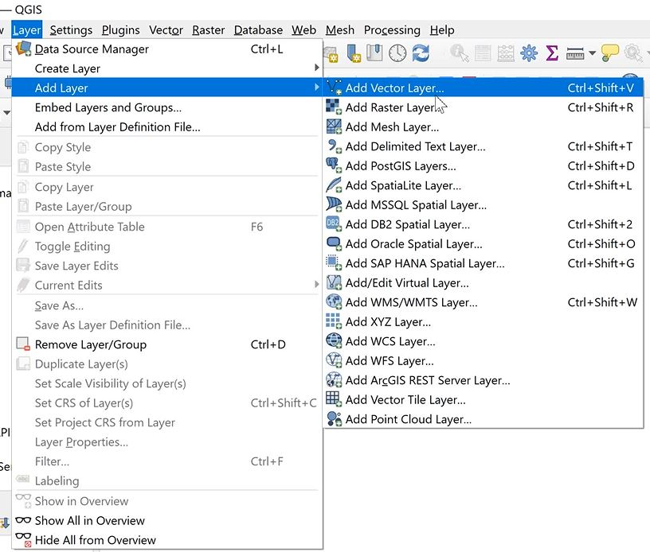{width=70%}


4. Click on the "..." button and navigate to location of Abula.shp file. Click on Add. You should see Figure 6 in your main pane.

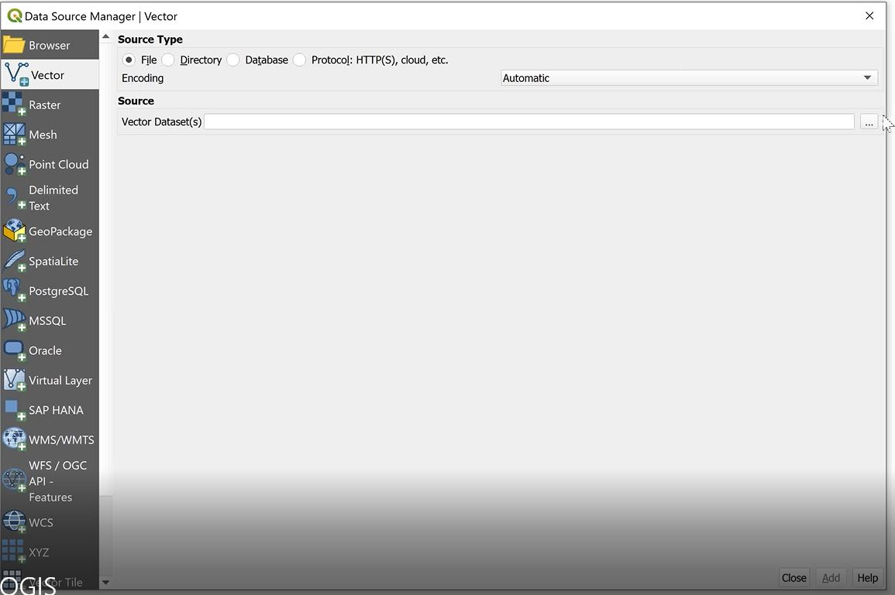

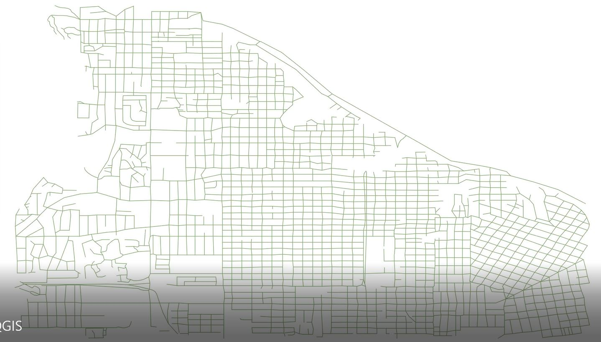


5. To make the map clearer, we will then change the lines from green to black. Right click on Abila under the layers panel > select Properties > select Symbology > click on the arrow dropdown next to Color and select black > Click Apply and Ok.

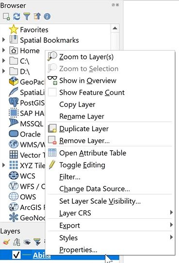{width=50%}

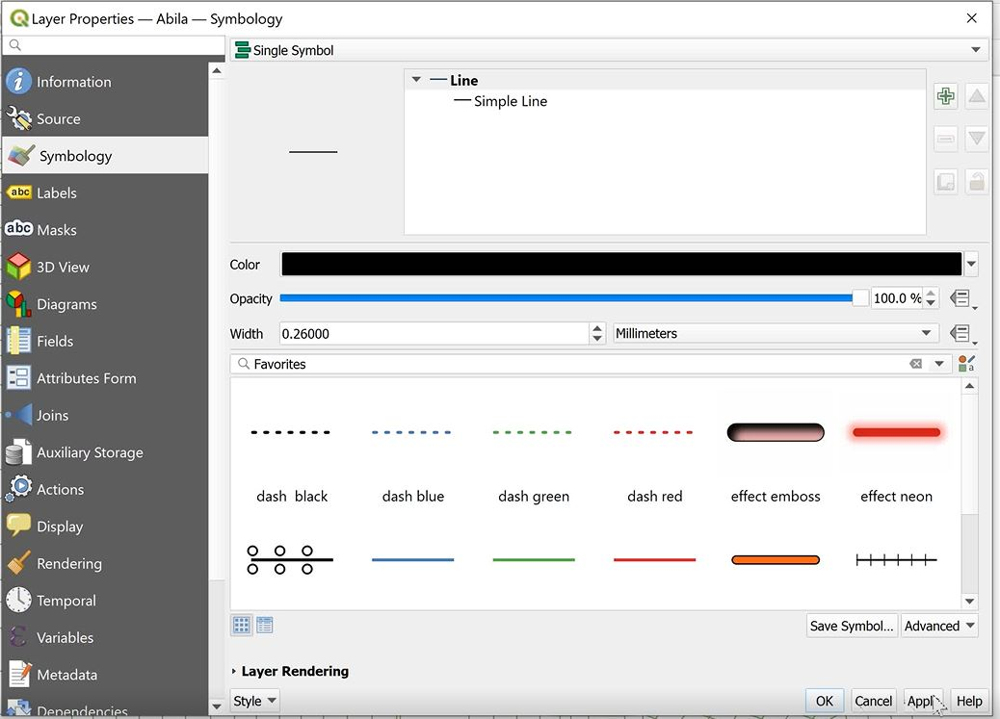


6. To perform the georeferencing, click on Raster on the top pane > Georeferencer. When the new window appears, click on the blue square symbol on the top left to access the image file. Navigate to the MC2- tourist JPG file. In order to perform georeferencing, we need to select reference points (at least 6 control points) from the tourist map to match to the corresponding points on the SHP file map.

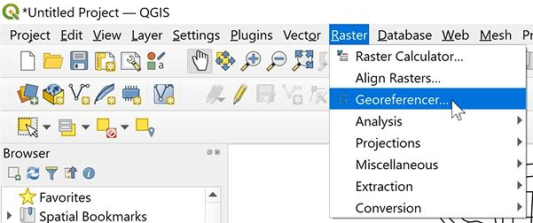{width=50%}

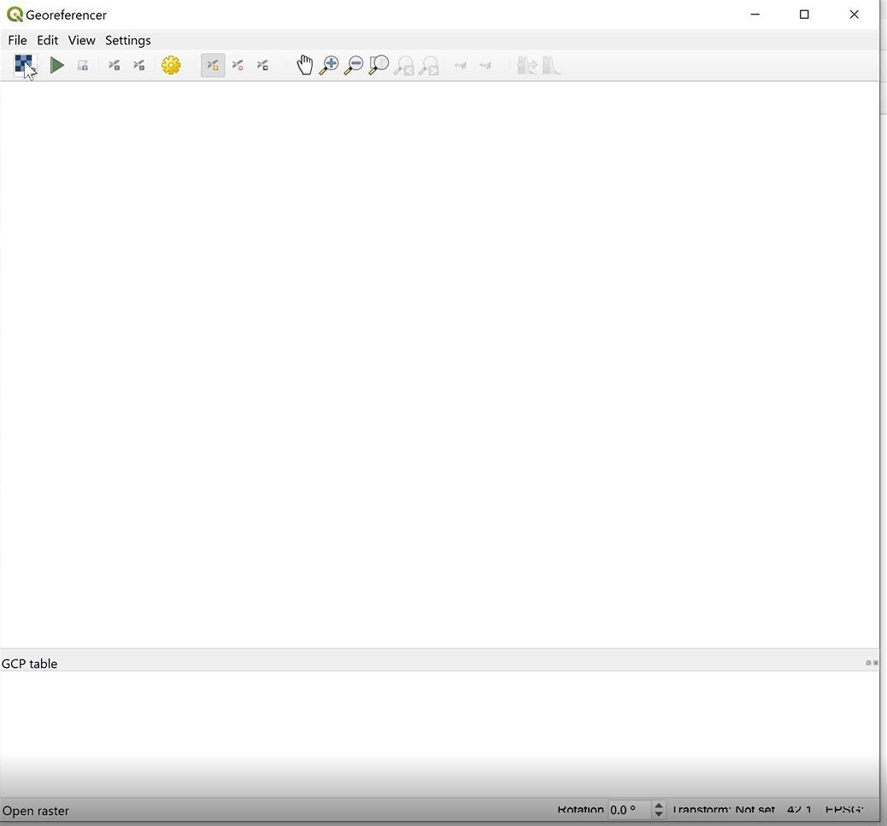{width=50%}


7. To match the corresponding points, click on the identify tool on the top pane. Hover over the suspected corresponding point and click on it. The Identify Results pane appears on the right corner. Observe the results by matching the road name specified on the Identify Results pane to the tourist map.


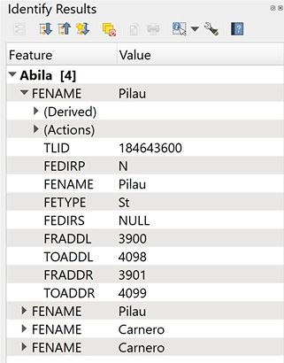{width=50%}


8. Once checked to be correct, under the Georeferencer, click on the selected point on the tourist map. On the Enter Map Coordinates window that appears, click on From Map Canvas and hover over the Shp file map. Ensure the crosshair is as close as possible to the actual point. By clicking on the point, this captures the X and Y coordinates. Click Ok. The GCP table in the Georeferencer window will be updated with the first reference point. Repeat the above steps for the other cross-reference points.

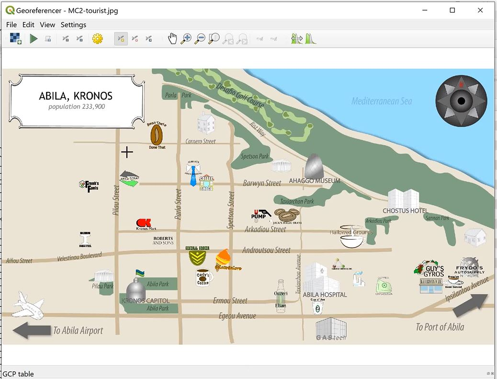

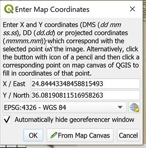{width=50%}

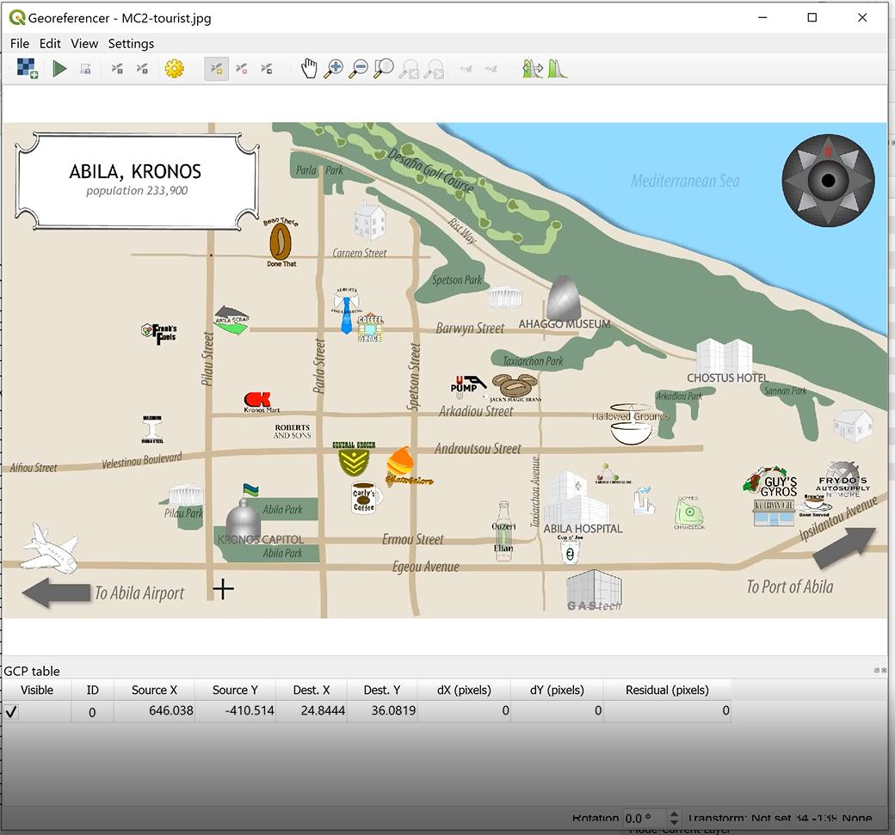


9. To check the settings, select Settings > Transformation Settings. Select the following settings as specified in Figure 17. Note that if the Target SRS is not set to WGS 84, click on the globe symbol next to the field and type "4326" under the filter pane. Select WGS 84 when it appears as the filtered result. Under output settings, ensure results are saved in a TIF file format for usage subsequently. Click on the tickbox next to "Save GCP points" and "Load in QGIS when done". Click ok.


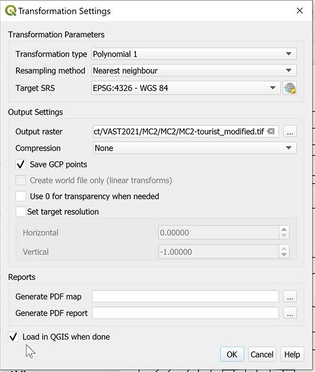{width=60%}

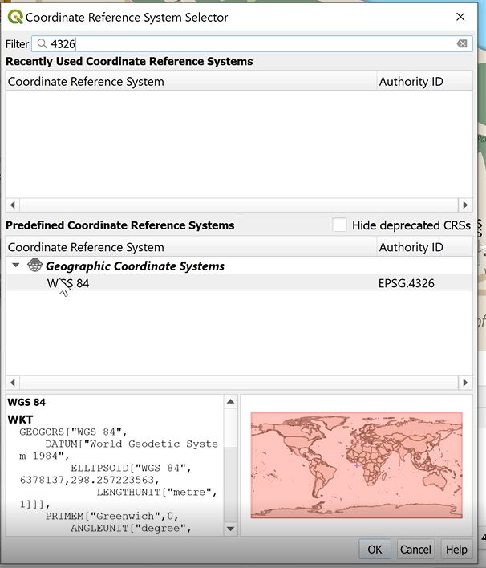{width=80%}


10. Select file on the top pane > select Start Georeferencing. Once georeferencing is completed, minimise the georeferencer pane and switch back to the map.

{width=60%}


11. Under the layers pane on the left, drag the image file below the Abila streetmap so that the streetmap can be plotted on top of the tourist map. Doing a check, we observe that the streetmap is well-aligned with the image file. The TIF file created can then be used in RStudio as a raster object.

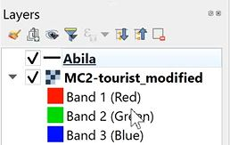{width=60%}

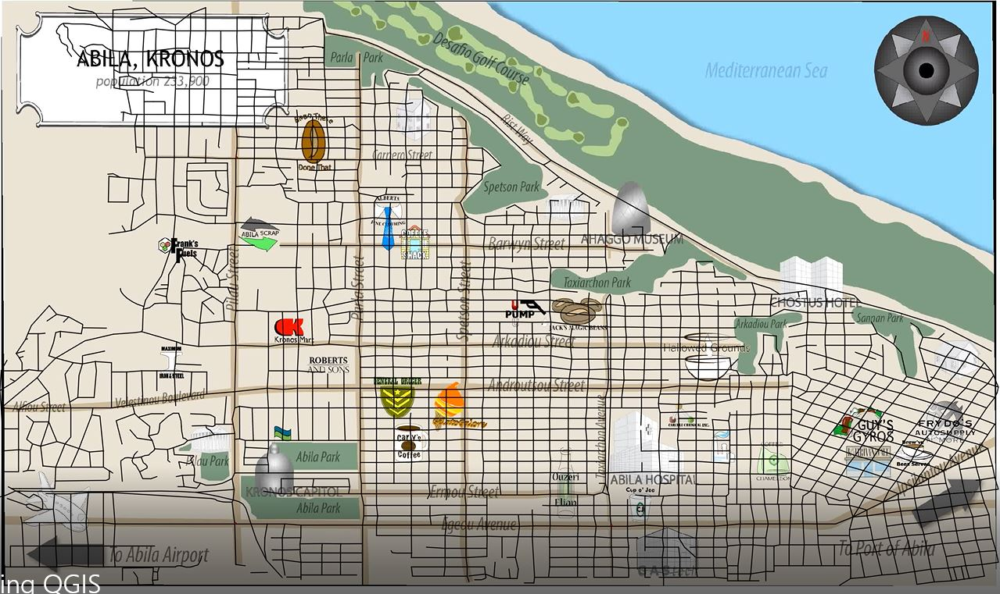


After preparing the georeferencing, we will then import the raster layer into RStudio.

```{r, tidy.opts=list(width.cutoff=60),tidy=TRUE}
##Import raster layer
bgmap <- raster("data/Geospatial/MC2-tourist.tif")
bgmap

tmap_mode("plot")
tm_shape(bgmap) +
  tm_rgb(bgmap, r = 1, g = 2, b = 3, alpha = NA, saturation = 1, interpolate = TRUE, max.value = 255)
```

Using st_read() of sf package, import Abila shapefile into R. We will then convert aspatial data to simple feature dataframe.

```{r}
##Import line data
Abila_st <- st_read(dsn = "data/Geospatial", layer = "Abila")
```

```{r, tidy.opts=list(width.cutoff=50),tidy=TRUE}
##Converting gps data to Simple Feature Data Frame
gps_data <- gps_data %>%
  mutate(day = get_day(gps_data$Timestamp), date = as_date(gps_data$Timestamp), minute = get_minute(gps_data$Timestamp), day_of_week = weekdays(gps_data$Timestamp), hour = get_hour(gps_data$Timestamp)) 

gps_data$timegroup = cut(gps_data$hour,c(0,4,8,12,16,20,24))
levels(gps_data$timegroup) = c("0-4","5-8","8-12","13-16","17-20","21-24")
gps_data

gps_sf <- st_as_sf(gps_data,
                   coords = c("long", "lat"),
                   crs = 4326)
```

Next, join the gps points into movement paths by using the drivers' IDs as unique identifiers.

```{r, tidy.opts=list(width.cutoff=60),tidy=TRUE}
##Creating movement path from GPS points
##Group by need to come with summarize--> in this case we summarize using mean timestamp but this value is not needed
gps_path <- gps_sf %>%
  group_by(id, day, timegroup, hour) %>%
  summarize(m = mean(Timestamp), do_union = FALSE) %>%
  st_cast("LINESTRING") %>%
  rename("timestamp" = "m") 
```

Checking the data, we noticed single coordinates pair in the line feature. The following code chunk is to identify and remove the orphan lines.

```{r}
##Remove one point linestrings
points = npts(gps_path, by_feature = TRUE)
gps_path <- cbind(gps_path, points)
gps_path_cleaned <-gps_path[!(gps_path$points== 1),]
```

Lastly, we then overplot the selected gps path onto the background tourist map.

```{r, tidy.opts=list(width.cutoff=60),tidy=TRUE}
##Plotting GPS paths
gps_path_selected <- gps_path_cleaned %>%
  filter(id == 1, day == 6)

tmap_mode("view")
tm_shape(bgmap) +
  tm_rgb(bgmap, r = 1, g = 2, b = 3, alpha = NA, saturation = 1, interpolate = TRUE, max.value = 255) +
  tm_shape(gps_path_selected) +
  tm_lines(col= "red")
```

By plotting the GPS coordinates using the Abila tourist map as background, we are able to visualize the path each vehicle is taking. The map is also interactive. Clicking on any point in the trajectory allows us to see the CarID, day and timestamp of the point in the route. This allows us to match the timestamp and location back to the credit card dataset, hence matching the credit card numbers to their corresponding CarID.

#### 2.2.1 Anomalies

1) After mapping the GPS trajectories, We also noted that there were no GPS data indicating that any car stopped near "Bean There Done That", "Brewed Awakenings", "Coffee Shack" and "Jack's Magical Beans" during the period of transactions- 12:00pm. Hence, these transactions are either incorrectly timed or may even be fraudulent.

```{r, tidy.opts=list(width.cutoff=60),tidy=TRUE}
##Interactive map
gps_path_selected <- gps_path_cleaned %>%
  filter(hour == 12)
  
tmap_mode("view")
tm_shape(bgmap) +
  tm_rgb(bgmap, r = 1, g = 2, b = 3, alpha = NA, saturation = 1, interpolate = TRUE, max.value = 255) +
  tm_shape(gps_path_selected) +
  tm_lines(col= "red")
```

2) Furthermore as mentioned above, we also noted that there are several transactions in Kronos Mart at 3am on 13 January and 19 January. By filtering the map for 3am, we noted that there were no cars near Kronos Mart. Hence, these transactions are either incorrectly timed or may even be fraudulent. 

```{r, tidy.opts=list(width.cutoff=60),tidy=TRUE, layout="l-body-outset", fig.width=6, fig.height=3}
##Facet map
gps_path_selected <- gps_path_cleaned %>%
  filter(hour == 3)
  
tmap_mode("plot")
tm_shape(bgmap) +
  tm_rgb(bgmap, r = 1, g = 2, b = 3, alpha = NA, saturation = 1, interpolate = TRUE, max.value = 255) +
  tm_shape(gps_path_selected) +
  tm_lines(col= "red") +
  tm_facets(by = "id", ncol = 3)
```

**Qn3- Can you infer the owners of each credit card and loyalty card? What is your evidence? Where are there uncertainties in your method? Where are there uncertainties in the data?**

### 3.1 GeoVisual Analysis

#### 3.1.1 Match CarID to credit card data

By plotting the GPS coordinates using the Abila tourist map as background, we are able to visualize the path each vehicle is using. The map is interactive- clicking on any point in the trajectory allows us to see the CarID, day and timestamp of the respective route. This allows us to match the timestamp and location back to the credit card dataset, hence matching the credit card numbers to their corresponding CarID. Alternatively, we can also use a facet map by hour of day to identify location of each card during each hour of the day.

By following the GPS coordinates of each carID, we are then able to identify the time that they arrive at certain points of interest in the map. With this information, we can match the points of interest to the credit card transactions at these locations, based on the timestamp on the GPS data and credit card data. After matching the unique CarID to the credit cards, we can then derive the owner of each card based on the car assignment data. Using a facet map allows us to visualize the route for each car during each hour across each of the 14 days of GPS data in record. This allows for easy observation and matching to the credit card data.

We have used an interactive map and facet map below to visualize the route for CarID 1 across 1/6/2014. This allows for easy observation and matching to the credit card data. 

```{r, tidy.opts=list(width.cutoff=60),tidy=TRUE}
##Plotting GPS paths- interactive map
gps_path_selected <- gps_path_cleaned %>%
  filter(id == 1, day == 6)

tmap_mode("view")
tm_shape(bgmap) +
  tm_rgb(bgmap, r = 1, g = 2, b = 3, alpha = NA, saturation = 1, interpolate = TRUE, max.value = 255) +
  tm_shape(gps_path_selected) +
  tm_lines(col= "red")
```

In this case, we can see that the day begins at 0720 where Car 1 drives towards Hallowed Grounds and stops here for 35 minutes. It then leaves Hallowed Grounds at 0757 and reaches Gastech at 0804. At 1217, Car 1 drives towards Albert's Fine Clothes, arriving at 1226. It departs at 1325 back to Gastech and arrives at 1334. At 1744, Car 1 leaves Gastech toward the area near Hallowed Grounds, arriving at 1748. At 1936, Car 1 leaves the area near Hallowed Grounds for an area near Albert's Fine Clothes and arrives at 1949. It then departs at 2027 back to the area near Hallowed Grounds, arriving at 2033. At 2211, Car 1 once again departs the area near Hallowed Grounds for Gastech, arriving at 2215, and only returns to the area near Hallowed Grounds at 0100 on 01/07/2014, arriving at 0114.

```{r, tidy.opts=list(width.cutoff=60),tidy=TRUE, layout="l-body-outset", fig.width=6, fig.height=5}
##Facet map- by hour
gps_path_selected <- gps_path_cleaned %>%
  filter(id == 1, day == 6)
  
tmap_mode("plot")
tm_shape(bgmap) +
  tm_rgb(bgmap, r = 1, g = 2, b = 3, alpha = NA, saturation = 1, interpolate = TRUE, max.value = 255) +
  tm_shape(gps_path_selected) +
  tm_lines(col = "red") +
  tm_facets(by = "hour", ncol = 3)
```

By visualizaing the route, we can filter the below credit card table for the relevant day, hour and location. The datatable below allows for multiple filters and this allows us to narrow down the list of credit cards which fits the criteria across the day. By repeating this process across the 14 days credit card transaction and location data provided, we will be able to match the credit card to CarID. 

In this case, by filtering the below table for Hallowed Grounds on day 6, hour 7, we noted that credit card number ending with 9551 is on the list of transactions. Repeating this process for the locations visited throughout the 2 weeks period, we have matched Car 1 to credit card number ending with 9551.

```{r, tidy.opts=list(width.cutoff=55),tidy=TRUE}
cc_data_cleaned_min <- subset(cc_data_cleaned, select = -c(daynumber, timestamp))
DT::datatable(cc_data_cleaned_min, filter = "top", fillContainer = T, options = list(scrollX=TRUE, autoWidth=TRUE, scroller=TRUE, scrollY = '450px'))
```

Based on interactive filtering and visualization of the maps above, we were able to match the GPS trajectories to the credit card data provided, based on location and timestamp. In the process, we noted that there car trajectories match more than 1 credit card match. This is seen for employees in the facilities department (carID: 29, 100 to 107). We also noted some credit cards without a CarID match.

We have imported the match via a CSV file below.

```{r}
##Import match
cc_carid_match <- read_csv("data/cc_carid_match.csv")

cc_carid_match$CarID = as.factor(cc_carid_match$CarID)
cc_carid_match$last4ccnum = as.factor(cc_carid_match$last4ccnum )
glimpse(cc_carid_match )
```

Using the above dataset, we will be able to identify the owners of each credit card by matching the carID to the car assignment dataset. Scanning through the table, we noted that Ovan Bertrand (Facilities Group Manager) is assigned CarID 29 and uses 2 different credit cards (1- ending with 3547, 2- ending with 5921).

In the car assignment dataset provided, truck drivers are not assigned to a particular truck number. Hence we are unable to identify which credit card belongs to which truck driver as there is no car assignment information provided. We have managed to match the trajectories of trucks to 9 different credit cards, which coincides with the number of truck drivers. Hence this reinforces our opinion that trucks are shared among the truck drivers. With the limited information, we are unable to match the credit card to truck driver, but only to the CarID.

```{r, tidy.opts=list(width.cutoff=55),tidy=TRUE}
##Non-truck drivers
cc_carid_emp_match_NT <- cc_carid_match %>%
  filter(CarID != 100 , CarID != 101 , CarID != 102 , CarID != 103 , CarID != 104 , CarID != 105 , CarID != 106 , CarID != 107) %>%
  left_join(assignment_data, "CarID") %>%
  arrange(CarID)

DT::datatable(cc_carid_emp_match_NT, filter = "top", fillContainer = T, options = list(scrollX=TRUE, autoWidth=TRUE, scroller=TRUE, scrollY = '450px'))
```

```{r, tidy.opts=list(width.cutoff=55),tidy=TRUE}
##Truck drivers
cc_carid_emp_match_T <- cc_carid_match %>%
  filter(CarID == 100 | CarID == 101 | CarID == 102 | CarID == 103 | CarID == 104 | CarID == 105 | CarID == 106 | CarID == 107) %>%
  arrange(CarID)
cc_carid_emp_match_T 
```

#### 3.1.2 Match credit card to loyalty card

After matching the timestamp of credit card transactions to CarID using the trajectory visualization, we can then match the credit card and loyalty card owners, using full join on 3 criteria match- 1) Date, 2) Location and 3) Price. 

```{r, tidy.opts=list(width.cutoff=55),tidy=TRUE}
##Match loyalty and credit cards
loyalty_cc_match <- cc_data_cleaned %>%
  full_join(loyalty_data_cleaned, by = c("date", "location", "price"))

loyalty_cc_match = subset(loyalty_cc_match, select = -c(day.y, daynumber.y, timestamp, weekday.y)) %>%
  rename("day" = "day.x", "daynumber" = "daynumber.x", "weekday" = "weekday.x")

DT::datatable(loyalty_cc_match, extensions='Scroller', fillContainer = T, filter = "top", options = list(scrollX=TRUE, autoWidth=TRUE, scroller=TRUE, scrollY = '450px')) %>% formatDate(4, method = 'toLocaleDateString')
```

After the full join, we noted that there are some transactions whereby the amount recorded on the loyalty card and credit card is different, hence resulting in N/As in the joined dataset. To correct this, we will drop rows with N/As and perform a group to identify which loyalty cards are mapped to each credit card. 

```{r, fig.height=6}
##Group by credit card number and loyalty card number
loyalty_cc_match_group <- loyalty_cc_match %>%
  group_by(last4ccnum, loyaltynum) %>%
  summarise(sumprice = sum(price)) %>%
  drop_na("last4ccnum", "loyaltynum")

##Check if each credit card is matched to each loyalty card
loyalty_cc_match_count <- loyalty_cc_match_group %>%
  group_by(last4ccnum) %>%
  summarise(loyalty_card_count = n()) %>%
  arrange(desc(loyalty_card_count))

loyalty_cc_match_count
```

Based on the above results, we noted that there are seven credit cards mapped to more than 1 loyalty card. This is likely to be a duplicate due to the method being used to match both cards. We will investigate each match individually to identify if its a true match or simply a coincidence. To differentiate the former from the latter, we will assess if there are several transactions made with the same combination of credit and loyalty card number. If there is only a single transaction made with the same combination, it is likely a coincidence. This can be done using the interactive datatable below.

```{r, tidy.opts=list(width.cutoff=55),tidy=TRUE}
DT::datatable(loyalty_cc_match, extensions='Scroller', fillContainer = T, filter = "top", options = list(scrollX=TRUE, autoWidth=TRUE, scroller=TRUE, scrollY = '450px')) %>% formatDate(4, method = 'toLocaleDateString')
```

After further investigation, it is noted that there are several transactions made with the same combination of credit and loyalty card number for the following combination:
    - Credit card number ending with 1286, matched with loyalty card number L3288 and L3572 

Hence the above is unlikely to be a coincidence. Loyalty cards L3288 and L3572 are being used together with the same credit card.

We will then perform a check on whether each loyalty card is used with one or multiple credit cards. We see eight loyalty cards matched to multiple credit cards.

To prevent similar case of coincidence from the matching method above, we filter for combinations with more than 1 transaction using the interactive datatable below. From the table below, we observe that L3288 and L6267 are used with 2 different credit cards.
    1) Loyalty card number L3288, matched with credit card number ending with 1286 and 9241
    2) Loyalty card number L6267, matched with credit card number ending with 6691 and 6899

```{r}
##Check for loyalty cards matched to multiple credit card
cc_loyalty_match_count <- cc_data_cleaned %>%
  full_join(loyalty_data_cleaned, by = c("date", "location", "price")) %>%
  group_by(last4ccnum, loyaltynum) %>%
  summarise(txncount = n()) %>%
  drop_na("last4ccnum", "loyaltynum") %>%
  group_by(loyaltynum) %>%
  summarise(cc_count = n()) %>%
  arrange(desc(cc_count))

cc_loyalty_match_count
```

```{r}
##Check for loyalty cards matched to multiple credit card, with > 1 txn
cc_loyalty_match_obs <- cc_data_cleaned %>%
  full_join(loyalty_data_cleaned, by = c("date", "location", "price")) %>%
  group_by(last4ccnum, loyaltynum) %>%
  summarise(txncount = n()) %>%
  filter(txncount > 1) %>%
  drop_na("last4ccnum", "loyaltynum") %>%
  group_by(loyaltynum) %>%
  summarise(cc_count = n()) %>%
  arrange(desc(cc_count))

cc_loyalty_match_obs
```

```{r, tidy.opts=list(width.cutoff=55),tidy=TRUE}
DT::datatable(loyalty_cc_match, extensions='Scroller', fillContainer = T, filter = "top", options = list(scrollX=TRUE, autoWidth=TRUE, scroller=TRUE, scrollY = '450px')) %>% formatDate(4, method = 'toLocaleDateString')
```

Given the assumption that the combination of credit and loyalty cards with only one transaction are due to coincidence, we will drop these duplicate matches.
    
```{r, tidy.opts=list(width.cutoff=55),tidy=TRUE}
loyalty_cc_match_cleaned<-loyalty_cc_match[!(loyalty_cc_match$last4ccnum == "4795" & loyalty_cc_match$loyaltynum == "L2070" | loyalty_cc_match$last4ccnum == "5921" & loyalty_cc_match$loyaltynum == "L9406" | loyalty_cc_match$last4ccnum == "7889" & loyalty_cc_match$loyaltynum == "L2247" | loyalty_cc_match$last4ccnum == "4948" & loyalty_cc_match$loyaltynum == "L3295" | loyalty_cc_match$last4ccnum == "5368" & loyalty_cc_match$loyaltynum == "L6119" | loyalty_cc_match$last4ccnum == "8332" & loyalty_cc_match$loyaltynum == "L8566"),]
```

We then match the loyalty and credit card data to the car assignment data matched with credit card.

```{r, tidy.opts=list(width.cutoff=60),tidy=TRUE}
cards_emp_match <- left_join(loyalty_cc_match_cleaned, cc_carid_match, by = "last4ccnum") %>%
  drop_na() %>%
  left_join(assignment_data, by = "CarID")
```

### 3.2 Uncertainties in method

1) **Assumption that employee will make a transaction when they visit a location.** GPS coordinates only infer that the employee was at a certain area but does not mean that he/she has to make any purchases when at that location. Hence matching GPS data to transaction data alone may not be accurate in some instances where employee does not spend or makes purchases using cash instead of credit card, which will not reflect in the credit card transaction dataset.

2) As the tourist map only shows certain tourist attractions and not all the locations in Abila, we are unable to match the full list of locations from trajectory as seen in the map view to the transactions occurring in locations which are not reflected in tourist map (e.g. Abila Zacharo). This may result in **incorrect matching as it is more of a guesswork** as not all locations visited in the GPS trajectory can be mapped to an actual transaction.

3) There are **differences in the amount recorded on credit card and loyalty card for certain transactions**, hence resulting in N/As in the joined dataset. We have removed the rows with N/As and instead worked with the joined data. However, this is based on the assumption that card transactions with same date, location and price relate to the same transaction. There may be instances of **pure coincidence** when this is not true, as described above.

4) We use the GPS coordinates of the car and credit card transactions to determine the employee's location. However, **employees may not have used their assigned car, or may not have made a purchase using their own loyalty or credit card**.
    
### 3.3 Uncertainties in data

1) Assuming that the car assignment list provided includes all employees, we noted that there are 44 distinct employees. However, we noted that there are 40 distinct GPS coordinates, 55 distinct credit card numbers and 54 distinct loyalty card numbers. Hence, we are **unable to map some of these other credit and loyalty cards to a CarID**. This may be because the car assignment data may not comprise of all employees.

2) We noted that some of the **timestamps provided in the credit card data seems inaccurate**. The transaction data for "Been There Done That". "Brewed Awakenings" and "Jack's Magical Beans" are all transacted on 12:00 time. Hence I suspect that this does not represent the actual time of the transaction. Therefore it is inaccurate to match GPS coordinates timestamp to the timestamp of these transactions.

3) **Background information did not specify how truck IDs are identified from the list of CarIDs.** We have inferred these based on the difference in IDs, inferring that truck IDs are three digit IDs.

4) **Truck drivers are not assigned a particular truck.** Hence even though we are able to match the GPS trajectories of these trucks to certain credit cards, we are unable to match the credit and loyalty cards back to the employees, unless we are provided with information regarding which employee has checked out which truck at certain timings.

**Qn4- Given the data sources provided, identify potential informal or unofficial relationships among GASTech personnel. Provide evidence for these relationships.**

### 4.1 Network Visualisation

We will first create a network graph using the following code chunks.

```{r, tidy.opts=list(width.cutoff=55),tidy=TRUE}
##Prepare data
cc_carid_emp_match <- cc_carid_match %>%
  drop_na() %>%
  left_join(assignment_data, by = "CarID")

cc_carid_emp_match$LastName[is.na(cc_carid_emp_match$LastName)] <- "Truck Driver"
cc_carid_emp_match$FirstName[is.na(cc_carid_emp_match$FirstName)] <- "Truck Driver"
cc_carid_emp_match$CurrentEmploymentType[is.na(cc_carid_emp_match$CurrentEmploymentType)] <- "Facilities"
cc_carid_emp_match$CurrentEmploymentTitle[is.na(cc_carid_emp_match$CurrentEmploymentTitle)] <- "Truck Driver"

cc_data_cleaned_matched <- cc_data_cleaned %>%
  left_join(cc_carid_emp_match, by = "last4ccnum")
```

```{r}
##Create nodes list
sources <- cc_data_cleaned_matched %>%
  distinct(last4ccnum) %>%
  rename(label = last4ccnum)

destinations <- cc_data_cleaned_matched %>%
  distinct(location) %>%
  rename(label = location)

##Create single df of unique users and locations
cc_nodes <- full_join(sources, destinations, by = "label")

##Add id column to nodes df
cc_nodes <- cc_nodes %>%
  rowid_to_column("id")

cc_nodes <- left_join(cc_nodes, cc_carid_emp_match, by = c("label" = "last4ccnum"))
cc_nodes <- cc_nodes %>%
  rename(group = CurrentEmploymentType)
```

```{r}
##Create edges list
edges <- cc_data_cleaned_matched %>%
  group_by(last4ccnum, location, day, hour) %>%
  summarise(weight = n()) %>%
  ungroup()
edges

##Tidy edges list
cc_edges <- edges %>%
  left_join(cc_nodes, by = c("last4ccnum" = "label")) %>%
  rename(from = id)

cc_edges <- cc_edges %>%
  left_join(cc_nodes, by = c("location" = "label")) %>%
  rename(to = id) %>%
  mutate(timegroup = "")

cc_edges$timegroup[cc_edges$hour < 07 & 00 <= cc_edges$hour] = "00 - 06"
cc_edges$timegroup[cc_edges$hour < 10 & 07 <= cc_edges$hour] = "07 - 09"
cc_edges$timegroup[cc_edges$hour < 12 & 10 <= cc_edges$hour] = "10 - 11"
cc_edges$timegroup[cc_edges$hour < 15 & 12 <= cc_edges$hour] = "12 - 14"
cc_edges$timegroup[cc_edges$hour < 17 & 15 <= cc_edges$hour] = "15 - 16"
cc_edges$timegroup[cc_edges$hour < 22 & 17 <= cc_edges$hour] = "17 - 21"
cc_edges$timegroup[cc_edges$hour <= 24 & 22 <= cc_edges$hour] = "22 - 24"

##Reorder columns
cc_edges <- select(cc_edges, from, to, day, hour, timegroup, weight)
```

```{r}
##Build network graph
cc_graph <- tbl_graph(nodes = cc_nodes,
                      edges = cc_edges,
                      directed = FALSE)
```

First, we can facet the graph by day and timegroup. Users can update the cc_edges_selected to observe the facet graph for each day. The facet below is for day 01/06/2014. From the facet graph, we observe that the interactions mainly occur in the morning (0700-0900), lunc time (1200-1400) and after work (1700-2100).

```{r, layout="l-body-outset", fig.width=12, fig.height=10}
##Facet
cc_edges_selected <- cc_edges %>%
  filter(day == 6)

cc_graph <- tbl_graph(nodes = cc_nodes,
                      edges = cc_edges_selected,
                      directed = FALSE)

set_graph_style()
g <- ggraph(cc_graph, layout = "nicely") + 
  geom_edge_link(aes(width = weight), alpha=0.2) +
  scale_edge_width(range = c(0.1, 5)) +
  geom_node_point(aes(colour = group), size = 2) 

g + facet_edges(day~timegroup) +
th_foreground(foreground = "grey80",
border = TRUE) +
theme(legend.position = 'bottom')
```
By using the below interactive network graph together with the use of a datatable, we are able to visualize the interactions between parties and locations and use the datatable to filter for the relevant parties and locations to identify whether they were in the same location during the same period.

For example, filtering for Desafio Golf Course highlights the employees who have visited the location over the two week period, We note that they are in the Executives department. We will then filter the datatable below for Desafio Golf Course and noted that there were several executives who were in this location on the same date and time, hence indicating a probable interaction between these executives.

```{r, layout="l-body-outset", fig.width=10, fig.height=9}
##Interactive viz

visNetwork(cc_nodes, cc_edges, height = "800px", width = "100%") %>%
  visIgraphLayout(layout = "layout_in_circle") %>%
  visOptions(highlightNearest = TRUE, nodesIdSelection = TRUE, selectedBy = "group") %>%
  visLegend() %>%
  visGroups(groupname = "Security", color = "#FFFFA3") %>%
  visGroups(groupname = "Engineering", color = "#FFAFB1") %>%
  visGroups(groupname = "Information Technology", color = "#A1EC76") %>%
  visGroups(groupname = "Facilities", color = "#F0B3F5") %>%
  visGroups(groupname = "Executive", color = "#FF3333") %>%
  visLayout(randomSeed = 123)
```

```{r, tidy.opts=list(width.cutoff=55),tidy=TRUE, fig.height=6}
cc_data_cleaned_matched <- subset(cc_data_cleaned_matched, select = -c(timestamp, day, price))
DT::datatable(cc_data_cleaned_matched, fillContainer = T, extensions='Scroller', filter = "top", options = list(scrollX=TRUE, autoWidth=TRUE, scroller=TRUE, scrollY = '450px'))
```

### 4.2 Network Analysis

We have derived the following potential informal relationships between employees.

1) Desafio Golf course- Several of the executives were congregated at the Desafio Golf Course on Sundays. Willem Vasco-Pais (Environmental Safety Advisor), Ingrid Barranco (SVP/CFO) and Ada Camp-Corrente (SVP/CIO) were present on 12/1/2014 at 1300-1400 and 19/1/2014 at 1200-1500. Sten Sanjorge Jr (President/CEO) and Orhan Strum (SVP/COO) joining during the second session.

2) Chostus Hotel- We see Elsa Orilla (Drill Technician) and Brand Tempestad (Drill Technician) from Engineering department checking into Chostus Hotel frequently on weekdays during lunch hour, up to four times over the two weeks observed. On further investigation, there are two employees with last name Orilla. We do not have further information on whether there is a relationship between them. However if they are partners, this may present as an illicit relationship given that it occurs frequently during lunch hours on weekdays when Kare Orilla is having lunch elsewhere.

3) Kronos Mart- Transactions noted on odd hours such as on 19/1/2014 at 0300 where Varja Lagos (Badging Office), Nils Calixto (IT Helpdesk) and Ada Campo-Corrente (SVP/CIO) made purchases during the same hour.

4) There were several locations only frequented by the Facilities department, such as Abila Airport, Kronos Pipe and Irrigation, Nationwide Refinery, Maximum Iron and Steel, Stewart and Sons Fabrication and Carlyle Chemical. Their visits are usually not at the same time.

5) Coffee Shack is visited by only one person with last 4 credit card number 7117 during lunch hour, on most weekdays.

6) Bean There Done That is popular with the Engineering team during lunch hour on most weekdays, with no transactions by this same group over the weekends.

7) Brewed Awakenings is favoured by Ingrid Barranco (SVP/CFO), Elsa Orilla (Drill Technician) and Ada Campo-Corrente (SVP/CIO) during lunch hour and they make purchases there frequently during the same periods, hence would probably have crossed paths here.

8) Jack's Magical Beans is favoured by Isak Baza (IT Technician), Isande Borrasca (Drill Technician), Orhan Strum (SVP/COO), Willem Vasco-Pais (Environmental Safety Advisor) during lunch hour and they make purchases there frequently during the same periods, hence would probably have crossed paths here.

9) Both Isia Vann (Perimeter Control) and Edvard Vann (Perimeter Control) have the same last name. We do not have further information on whether there is a relationship between them. However, on further investigation, they seem to have a close relationship given that there were multiple times where they made transactions in the same location during the same date and hour, such as the following:
    - On 7/1/2014, 13/1/2014, 14/1/2014, they made transactions at Guy's Gyros at 2000-2100.
    - On 8/1/2014, 9/1/2014, 10/1/2014, 13/1/2014, 14/1/2014, 15/1/2014, 16/1/2014 and 17/1/2014, they made transactions at Brew've Been Served at 0700-0800.
    - On 14/1/2014, 19/1/2014, they made transactions at Katerina's Cafe at 1300.
    
10) Both Birgitta Frente (Geologist) and Vira Frente (Hydraulic Technician) have the same last name. We do not have further information on whether there is a relationship between them. However, on further investigation, they do not seem to have a particularly close relationship as there was only one time where they made transactions in the same location during the same date and hour- On 13/1/2014 at Bean There Done That at 1200.

11) There are other employees with the same last names such as Minke Mies and Henk Mies, Valeria Morlun and Adan Morlun, Claudio Hawelon and Benito Hawelon. However as some of them belong to the facilities truck drivers team, where due to the data limitations, we are unable to match each the CarID to Employee Name, we are unable to identify the routes of these truck drivers to determine if they were in the same location with the employees with similar last names.

**Qn5- Do you see evidence of suspicious activity? Identify 1- 10 locations where you believe the suspicious activity is occurring, and why.**

### 5.1 Suspicious Activities identified

We have identified the following suspicious activities:

1) **Unusual transactions and frequent overtime**

Nils Calixto (IT Helpdesk) returned back to Gastech during late hours frequently. This is highly suspicious as the nature of his role does not seem to require returning to office during late nights when there are few employees at work. 

From the facet graph below, we observe that he has returned to office during the period 2100-2400 on 01/06/2014, 01/08/2014, 01/15/2014 and 01/17/2014.

```{r, tidy.opts=list(width.cutoff=60),tidy=TRUE, layout="l-body-outset", fig.width=6, fig.height=3, fig.cap="Facet graph of CarID 1 at time 2100-2400 by day"}
##Facet map- by day
gps_path_selected <- gps_path_cleaned %>%
  filter(id == 1, timegroup == "21-24")
  
tmap_mode("plot")
tm_shape(bgmap) +
  tm_rgb(bgmap, r = 1, g = 2, b = 3, alpha = NA, saturation = 1, interpolate = TRUE, max.value = 255) +
  tm_shape(gps_path_selected) +
  tm_lines(col = "red") +
  tm_facets(by = "day", ncol = 3)
```

Filtering the datatable below, we also observe that Nils Calixto has made several suspicious transactions on his credit card on 01/13/2014:
    - Spent $10,000 at Frydos Autosupply n' More at 1920. This expenditure has been identified as an outlier during our exploratory analysis performed earlier. This further raises suspicions due to the large transaction amount. Furthermore, by tracking the car's movements throughout the day, we noted that the car was not at Frydos Autosupply n' More at this time.
    - Made a purchase at U-Pump at 1318 on 01/13/2014. However, we noted that Nils Calixto GPS coordinates put him at an area near Albert's Fine Clothes instead of U-Pump when the credit card transaction was made.
    - Only person to have made a transaction at Daily Dealz at 0604. However, there were no GPS information during this time. As the vehicles are tracked as long as they are moving, one would assume that Nils Calixto did not drive to Daily Dealz to make the purchase.
    
```{r, tidy.opts=list(width.cutoff=55),tidy=TRUE, layout="l-body-outset", fig.width=12, fig.height=10, fig.cap="Datatable of credit card transactions"}
cc_data_cleaned_matched_DT <- subset(cc_data_cleaned_matched, select = -c(daynumber))
DT::datatable(cc_data_cleaned_matched_DT, extensions='Scroller', filter = "top", fillContainer = T, options = list(scrollX=TRUE, autoWidth=TRUE, scroller=TRUE, scrollY = '450px'))
```

```{r, tidy.opts=list(width.cutoff=60),tidy=TRUE, fig.cap="Interactive map of CarID 1 on day 13, timegroup 1300-1600"}
##Plotting GPS paths- interactive map
gps_path_selected <- gps_path_cleaned %>%
  filter(id == 1, day == 13, timegroup == "13-16")

tmap_mode("view")
tm_shape(bgmap) +
  tm_rgb(bgmap, r = 1, g = 2, b = 3, alpha = NA, saturation = 1, interpolate = TRUE, max.value = 255) +
  tm_shape(gps_path_selected) +
  tm_lines(col= "red")
```

2) **Gathering of employees** 

There seems to have been a gathering by certain employees on 01/10/2014 till late. Employees only started leaving at around 2300. We filter for the day and hour and plotted a facet map. By tracing the employees route with the interactive facet map below, we noted that except for Isia Vann (Perimeter Control)(CarID 16) and Willem Vasco-Pais (Environmental Safety Advisor, CarID 35), the other employees seem to leave the house in Carnero Street at around 2300 to return to their respective homes. We have excluded Isia Vann and Willem Vasco-Pais as the route is different from the others. We also noted that two other employees left the gathering later than the others- Felix Balas and Marin Onda. 

The employees who attended the gathering seem to be mainly from the Engineering and Information Technology department. We noted that this area seems to be Lars Azada's house and hence he may be the host. We have inferred that this is his house as by tracking the trajectories of his movement, we noted that he tends to return to this location during afterwork hours.
    - Nils Calixto (IT Helpdesk)- CarID 1
    - Isak Baza (IT Technician)- CarID 5
    - Linnea Bergen (IT Group Manager)- CarID 6
    - Lucas Alcazar (IT Technician)- CarID 8
    - Lars Azada (Engineer)- CarID 2
    - Elsa Orilla (Drill Technician)- CarID 7
    - Gustav Cazar (Drill Technician)- CarID 9
    - Axel Calzas (Hydraulic Technician)- CarID 11
    - Lidelse Dedos (Engineering Group Manager)- CarID 14
    - Birgitta Frente (Geologist)- CarID 18
    - Vira Frente (Hydraulic Technician)- CarID 19
    - Kanon Herrero (Geologist)- CarID 25
    - Isande Borrasca (Drill Technician)- CarID 28
    - Brand Tempestad (Drill Technician)- CarID 33
    - Felix Balas (Engineer)- CarID 3 (left later at 11/1/2014 0000)
    - Marin Onda (Drill Site Manager)- CarID 26 (left later at 11/1/2014 0000)
    
```{r, tidy.opts=list(width.cutoff=60),tidy=TRUE, layout="l-body-outset", fig.width=6, fig.height=7.5, fig.cap="Facet graph of all cars moving at time 2200 - 2300 on day 10"}
##Facet map- by id
gps_path_selected <- gps_path_cleaned %>%
  filter(day == 10, hour == 23 | hour == 22)
  
tmap_mode("plot")
tm_shape(bgmap) +
  tm_rgb(bgmap, r = 1, g = 2, b = 3, alpha = NA, saturation = 1, interpolate = TRUE, max.value = 255) +
  tm_shape(gps_path_selected) +
  tm_lines(col = "red") +
  tm_facets(by = "id", ncol = 3)
```

```{r, tidy.opts=list(width.cutoff=60),tidy=TRUE, fig.cap="Facet graph of all cars moving at time 0000 on day 11"}
##Facet map- by id
gps_path_selected <- gps_path_cleaned %>%
  filter(day == 11, hour == 00)
  
tmap_mode("plot")
tm_shape(bgmap) +
  tm_rgb(bgmap, r = 1, g = 2, b = 3, alpha = NA, saturation = 1, interpolate = TRUE, max.value = 255) +
  tm_shape(gps_path_selected) +
  tm_lines(col = "red") +
  tm_facets(by = "id", ncol = 3)
```

3) **Suspicious visit to a house late at night**

Isia Vann (Perimeter Control)(CarID 16) visited a house in Barwyn Street late on 01/10/2014 at 2300 and only left on 01/11/2014 at 0300. This seems to be a one-time occurrence throughout the two weeks.

```{r, tidy.opts=list(width.cutoff=60),tidy=TRUE, fig.cap="Interactive graph of CarID16 at time 2300 on day 10"}
##Interactive map
gps_path_selected <- gps_path_cleaned %>%
  filter(id == 16, day == 10, hour == 23)
  
tmap_mode("view")
tm_shape(bgmap) +
  tm_rgb(bgmap, r = 1, g = 2, b = 3, alpha = NA, saturation = 1, interpolate = TRUE, max.value = 255) +
  tm_shape(gps_path_selected) +
  tm_lines(col= "red")
```

```{r, tidy.opts=list(width.cutoff=60),tidy=TRUE, fig.cap="Interactive graph of CarID 16 at time 0300 on day 11"}
##Interactive map
gps_path_selected <- gps_path_cleaned %>%
  filter(id == 16, day == 11, hour == 3)
  
tmap_mode("view")
tm_shape(bgmap) +
  tm_rgb(bgmap, r = 1, g = 2, b = 3, alpha = NA, saturation = 1, interpolate = TRUE, max.value = 255) +
  tm_shape(gps_path_selected) +
  tm_lines(col= "red")
```

4) **Monitoring of CIO's house at odd hours**

The following employees have been visiting a similar location near Spetson Park late at night. On further investigation, this seems to be the Ada Campo-Corrente's (CIO) house. We have inferred that this is the CIO house by tracking the trajectories of her movement. We noted that she tends to return to this location during afterwork hours.
    - Loreto Bodrogi (Site Control, CarID 15) visited an area near Spetson Park on 01/07/2014 at 0335, departing from his house at 0320. He only departed the area at 0729 and made a purchase at Brewed Awakenings before heading directly to Gastech. 
    - Isia Vann (Perimeter Control, CarID 16) also had a similar trajectory as Loreto Bodrogi. She left her house at 2301 on 01/06/2014 and arrived at the area near Spetson Park at 2309. She then remained in the same area and left only at 0730 and drove directly to Gastech without making any other stops. 
    - Both Loreto and Isia's paths would have crossed on their trip to the area near Spetson Park on 01/07/2014. They also left around the same time. They both took the same route to Gastech although Loreto Bodrogi made a transaction at Brewed Awakenings.

```{r, tidy.opts=list(width.cutoff=60),tidy=TRUE, fig.cap="Facet graph of CarID 10 at 1800 (afterwork hours)"}
##Facet map
gps_path_selected <- gps_path_cleaned %>%
  filter(id == 10, hour == 18)
  
tmap_mode("plot")
tm_shape(bgmap) +
  tm_rgb(bgmap, r = 1, g = 2, b = 3, alpha = NA, saturation = 1, interpolate = TRUE, max.value = 255) +
  tm_shape(gps_path_selected) +
  tm_lines(col= "red") +
  tm_facets(by = "day", ncol = 3)
```

```{r, tidy.opts=list(width.cutoff=60),tidy=TRUE, fig.cap="Interactive graph of CarID 15 on 01/07/2014"}
##Interactive map
gps_path_selected <- gps_path_cleaned %>%
  filter(id == 15, day == 7)
  
tmap_mode("view")
tm_shape(bgmap) +
  tm_rgb(bgmap, r = 1, g = 2, b = 3, alpha = NA, saturation = 1, interpolate = TRUE, max.value = 255) +
  tm_shape(gps_path_selected) +
  tm_lines(col= "red") 
```

```{r, tidy.opts=list(width.cutoff=60),tidy=TRUE, fig.cap="Interactive graph of CarID 16 on 01/06/2014"}
##Interactive map
gps_path_selected <- gps_path_cleaned %>%
  filter(id == 16, day == 6, hour == 23)
  
tmap_mode("view")
tm_shape(bgmap) +
  tm_rgb(bgmap, r = 1, g = 2, b = 3, alpha = NA, saturation = 1, interpolate = TRUE, max.value = 255) +
  tm_shape(gps_path_selected) +
  tm_lines(col= "red") 
```

5) **Monitoring of COO's house at odd hours**

The following employees have been visiting a similar location near Taxichorn Park late at night. On further investigation, this seems to be the Orhan Strum's (COO) house. We have inferred that this is the COO house by tracking the trajectories of his movement. We noted that he tends to return to this location during afterwork hours.
    - Loreto Bodrogi (Site Control, CarID 15) also visited an area near Taxichorn Park on 01/09/2014 at 0332, departing from his house at 0320. He only departed the area at 0723 and stopped by Jack's Magical Beans before heading directly to Gastech.
    - Minke Mies (Perimeter Control, CarID 24) also visited Taxichorn Park on 01/09/2014, departing from his house at 2300 on 01/08/2014 and arriving at 2306. He only departed the area at 0330 and headed directly home, reaching at 0340.
    - Minke Mies left Taxichorn Park just as Loreto Bodrogi arrived. This is highly suspicious as they seem to be taking shifts for some kind of stakeout.

```{r, tidy.opts=list(width.cutoff=60),tidy=TRUE, layout="l-body-outset", fig.width=6, fig.height=7.5, fig.cap="Facet graph of CarID 32 at 1700-1800 (afterwork hours)"}
##Interactive map
gps_path_selected <- gps_path_cleaned %>%
  filter(id == 32, hour == 18 | hour == 17)
  
tmap_mode("plot")
tm_shape(bgmap) +
  tm_rgb(bgmap, r = 1, g = 2, b = 3, alpha = NA, saturation = 1, interpolate = TRUE, max.value = 255) +
  tm_shape(gps_path_selected) +
  tm_lines(col= "red") +
  tm_facets(by = "day", ncol = 3)
```

```{r, tidy.opts=list(width.cutoff=60),tidy=TRUE, fig.cap="Interactive graph of CarID 15 on 01/09/2014"}
##Interactive map
gps_path_selected <- gps_path_cleaned %>%
  filter(id == 15, day == 9)
  
tmap_mode("view")
tm_shape(bgmap) +
  tm_rgb(bgmap, r = 1, g = 2, b = 3, alpha = NA, saturation = 1, interpolate = TRUE, max.value = 255) +
  tm_shape(gps_path_selected) +
  tm_lines(col= "red") 
```

```{r, tidy.opts=list(width.cutoff=60),tidy=TRUE, fig.cap="Interactive graph of CarID 24 on 01/08/2014"}
##Interactive map
gps_path_selected <- gps_path_cleaned %>%
  filter(id == 24, day == 8, hour == 23)
  
tmap_mode("view")
tm_shape(bgmap) +
  tm_rgb(bgmap, r = 1, g = 2, b = 3, alpha = NA, saturation = 1, interpolate = TRUE, max.value = 255) +
  tm_shape(gps_path_selected) +
  tm_lines(col= "red") 
```

6) **Driving around Abila without making any transactions**

On 01/11/2014 night, Bertrand Ovan (Facilities Group Manager, CarID 29) visited a sequence of places, without making any transactions. He left his house at 22:11, arriving at Brew've Been Served Cafe at 2212. After staying for 9 minutes, he went to the Ouzeri Elian, arriving at 2227. He then left at 2234 and headed for the place near Kronos Mart and arrived at 22:40. 15 minutes later, he went to the Alberts Fine Clothing arriving at 2258 and stayed there for another 23 minutes. He drove to an area near U-Pump or Jack Magic Beans, starting from 2321 and arrived at the at 23:25. He stayed there for about 30 minutes, and arrived home at exactly 2359. This is quite unusual as he visited several locations without making any transactions. 

```{r, tidy.opts=list(width.cutoff=60),tidy=TRUE, fig.cap="Interactive graph of CarID 29 on 01/11/2014"}
##Interactive map
gps_path_selected <- gps_path_cleaned %>%
  filter(id == 29, day == 11, timegroup == "21-24")
  
tmap_mode("view")
tm_shape(bgmap) +
  tm_rgb(bgmap, r = 1, g = 2, b = 3, alpha = NA, saturation = 1, interpolate = TRUE, max.value = 255) +
  tm_shape(gps_path_selected) +
  tm_lines(col= "red") 
```

```{r, tidy.opts=list(width.cutoff=55),tidy=TRUE, layout="l-body-outset", fig.width=12, fig.height=10, fig.cap="Datatable of credit card transactions"}
cc_data_cleaned_matched_DT <- subset(cc_data_cleaned_matched, select = -c(daynumber))
DT::datatable(cc_data_cleaned_matched_DT, extensions='Scroller', filter = "top", fillContainer = T, options = list(scrollX=TRUE, autoWidth=TRUE, scroller=TRUE, scrollY = '450px'))
```

7) **Monitoring of CFO's house at odd hours**

The following employees have been visiting a similar location late at night. On further investigation, this seems to be the CFO's house. We have inferred that this is the Ingrid Barranco's (CFO) house as by tracking the trajectories of her movement, we noted that she tends to return to this location during afterwork hours.
    - Isia Vann (Perimeter Control, CarID 16) left her house at 2300 on 01/10/2014 and arrived at the house near Ahaggo Museum at 2320. She then left only at 0323 on 01/11/2014 and drove home, arriving home at 0334.
    - Minke Mies (Perimeter Control, CarID 24) also visited house near Ahaggo Musuem on 01/14/2014, departing from his house at 0320 and arriving at 0331. He only departed the area at 0747 and headed directly to Gastech. This seems to be the same area that Isia Vann visited on 01/10/2014.
    - Hennies Osvaldo (Perimeter Control, CarID 21) also visited house near Ahaggo Musuem on 01/11/2014, departing from his house at 0320 and arriving at 0332. He only departed the area at 1102 on 01/11/2014 and headed to an area near Port of Abila, reaching at 1111. Hennies Osvaldo also made a similar trip on 01/13/2014, departing from his house at 2300 and arriving at 2308, leaving at 0330 on 01/14/2014 and arriving home at 0343 on 01/14/2014.
    - Both Minke Mies and Hennies Osvaldo may have crossed paths on 01/14/2014 as they seem to only miss each other by a minute.
    - Both Isia Vann  and Hennies Osvaldo may have crossed paths on 01/11/2014 as they seem to only miss each other by a short period of time.

```{r, tidy.opts=list(width.cutoff=60),tidy=TRUE, layout="l-body-outset", fig.width=6, fig.height=7.5, fig.cap="Facet graph of CarID 4 at 1700-1800 (afterwork hours)"}
##Interactive map
gps_path_selected <- gps_path_cleaned %>%
  filter(id == 4, hour == 18 | hour == 17)
  
tmap_mode("plot")
tm_shape(bgmap) +
  tm_rgb(bgmap, r = 1, g = 2, b = 3, alpha = NA, saturation = 1, interpolate = TRUE, max.value = 255) +
  tm_shape(gps_path_selected) +
  tm_lines(col= "red") +
  tm_facets(by = "day", ncol = 3)
```

```{r, tidy.opts=list(width.cutoff=60),tidy=TRUE, fig.cap="Interactive graph of CarID 16 on 01/10/2014, timegroup 2100-2400"}
##Interactive map
gps_path_selected <- gps_path_cleaned %>%
  filter(id == 16, day == 10, timegroup == "21-24")
  
tmap_mode("view")
tm_shape(bgmap) +
  tm_rgb(bgmap, r = 1, g = 2, b = 3, alpha = NA, saturation = 1, interpolate = TRUE, max.value = 255) +
  tm_shape(gps_path_selected) +
  tm_lines(col= "red") 
```

```{r, tidy.opts=list(width.cutoff=60),tidy=TRUE, fig.cap="Interactive graph of CarID 24 on 01/14/2014"}
##Interactive map
gps_path_selected <- gps_path_cleaned %>%
  filter(id == 24, day == 14)
  
tmap_mode("view")
tm_shape(bgmap) +
  tm_rgb(bgmap, r = 1, g = 2, b = 3, alpha = NA, saturation = 1, interpolate = TRUE, max.value = 255) +
  tm_shape(gps_path_selected) +
  tm_lines(col= "red") 
```

```{r, tidy.opts=list(width.cutoff=60),tidy=TRUE, fig.cap="Interactive graph of CarID 21 on 01/11/2014"}
##Interactive map
gps_path_selected <- gps_path_cleaned %>%
  filter(id == 21, day == 11)
  
tmap_mode("view")
tm_shape(bgmap) +
  tm_rgb(bgmap, r = 1, g = 2, b = 3, alpha = NA, saturation = 1, interpolate = TRUE, max.value = 255) +
  tm_shape(gps_path_selected) +
  tm_lines(col= "red") 
```

```{r, tidy.opts=list(width.cutoff=60),tidy=TRUE, fig.cap="Graph of CarID 21 on 01/13/2014 and 01/14/2014"}
gps_path_selected1 <- gps_path_cleaned %>%
  filter(id == 21, day == 13, hour == 23)
  
m1 <- tm_shape(bgmap) +
  tm_rgb(bgmap, r = 1, g = 2, b = 3, alpha = NA, saturation = 1, interpolate = TRUE, max.value = 255) +
  tm_shape(gps_path_selected1) +
  tm_lines(col= "red") 

gps_path_selected2 <- gps_path_cleaned %>%
  filter(id == 21, day == 14, hour == 3)
  
m2 <- tm_shape(bgmap) +
  tm_rgb(bgmap, r = 1, g = 2, b = 3, alpha = NA, saturation = 1, interpolate = TRUE, max.value = 255) +
  tm_shape(gps_path_selected2) +
  tm_lines(col= "red") 

current.mode <- tmap_mode("plot")
tmap_arrange(m1,m2)
tmap_mode(current.mode)
```

8) **Hennie Osvaldo's multiple residences**

Hennie Osavado seems to own two residences- 1) Area next to Guy's Gyros, 2) Area near Frydo's Autosupply N'More. He typically returns to the second house on weekdays and the first house on weekends, with the exception of 01/08/2014 and 01/15/2014.

```{r, tidy.opts=list(width.cutoff=60),tidy=TRUE, layout="l-body-outset", fig.width=6, fig.height=7.5, fig.cap="Facet graph of CarID 21 on from 1700-2400"}
##Facet map- by day
gps_path_selected <- gps_path_cleaned %>%
  filter(id == 21, timegroup == "21-24"| timegroup == "17-20")
  
tmap_mode("plot")
tm_shape(bgmap) +
  tm_rgb(bgmap, r = 1, g = 2, b = 3, alpha = NA, saturation = 1, interpolate = TRUE, max.value = 255) +
  tm_shape(gps_path_selected) +
  tm_lines(col = "red") +
  tm_facets(by = "day", ncol = 3)
```

9) **Potential relationship between Elsa Orilla and Brand Tempestad**

As discussed above, we also noted that Elsa Orilla (Drill Technician, CarID 7) and Brand Tempestad (Drill Technician, carID 33) frequently visited Chostus Hotel on weekdays during lunch hour, up to four times over the two weeks observed (01/08/2014, 01/10/2014, 01/14/2014, 01/17/2014). This can be seen from their credit card transactions using the datatable below.

On further investigation, there are two employees with last name Orilla. We do not have further information on whether there is a relationship between them. However if they are partners, this may present as an illicit relationship given that it occurs frequently during lunch hours on weekdays when Kare Orilla is having lunch elsewhere. We also noticed that both parties tend to stagger their departure time from the location for about 10 minutes.

```{r, tidy.opts=list(width.cutoff=60),tidy=TRUE, layout="l-body-outset", fig.width=6, fig.height=7.5, fig.cap="Facet graph of CarID 21 during 1200-1400"}
##Facet map- by id
gps_path_selected <- gps_path_cleaned %>%
  filter(id == 7, hour == 12| hour == 13| hour == 14)
  
tmap_mode("plot")
tm_shape(bgmap) +
  tm_rgb(bgmap, r = 1, g = 2, b = 3, alpha = NA, saturation = 1, interpolate = TRUE, max.value = 255) +
  tm_shape(gps_path_selected) +
  tm_lines(col = "red") +
  tm_facets(by = "day", ncol = 3)
```

```{r, tidy.opts=list(width.cutoff=60),tidy=TRUE, layout="l-body-outset", fig.width=6, fig.height=6, fig.cap="Facet graph of CarID 33 during 1200-1400"}
##Facet map- by id
gps_path_selected <- gps_path_cleaned %>%
  filter(id == 33, hour == 12| hour == 13| hour == 14)
  
tmap_mode("plot")
tm_shape(bgmap) +
  tm_rgb(bgmap, r = 1, g = 2, b = 3, alpha = NA, saturation = 1, interpolate = TRUE, max.value = 255) +
  tm_shape(gps_path_selected) +
  tm_lines(col = "red") +
  tm_facets(by = "day", ncol = 3)
```

```{r, tidy.opts=list(width.cutoff=55),tidy=TRUE, layout="l-body-outset", fig.width=12, fig.height=10, fig.cap="Datatable of credit card transactions"}
cc_data_cleaned_matched_DT <- subset(cc_data_cleaned_matched, select = -c(daynumber))
DT::datatable(cc_data_cleaned_matched_DT, extensions='Scroller', filter = "top", fillContainer = T, options = list(scrollX=TRUE, autoWidth=TRUE, scroller=TRUE, scrollY = '450px'))
```

10) **Repeated visits to locations not near eateries**

Hennie Osvaldo (Perimeter Control, CarID 21), Minke Mies (Perimeter Control, CarID 24), Inga Ferro (Site Control, CarID 13) and Loreto Bodrogi (Site Control, CarID 15) usually take turns visiting a selected few locations during the lunch break (except for 01/06/2014, 01/12/2014 and 01/19/2014). These locations include 1) Area near Frank's Fuels, 2) Area west of Bean There Done That, 3) Area south of Hallowed Grounds, 4) Area south of Katerina's Cafe and 5) Area south-west of the Arkadious Park. These locations are not near most of the usual dining locations and some tend to be quite out of the way. Hence this has been raised as suspicious behavior.

```{r, tidy.opts=list(width.cutoff=60),tidy=TRUE, layout="l-body-outset", fig.width=6, fig.height=7.5, fig.cap="Facet graph of the various car trajectories during 1200-1300"}
##Facet map- by id
gps_path_selected <- gps_path_cleaned %>%
  filter(id == 21 | id == 24 | id == 13 | id == 15, hour == 12 | hour == 13)
  
tmap_mode("plot")
tm_shape(bgmap) +
  tm_rgb(bgmap, r = 1, g = 2, b = 3, alpha = NA, saturation = 1, interpolate = TRUE, max.value = 255) +
  tm_shape(gps_path_selected) +
  tm_lines(col = "red") +
  tm_facets(by = "day", ncol = 3)
```

11) **Suspicious transactions and activities at petrol stations**

Given that there are relatively few records at gas stations (U-Pump and Frank's Fuels), we assume that GasTech provides free petrol for their employee cars. Scanning through the few records at gas stations, we note the following:
    - Varja Lagos (Badging Office, CarID 23) made a transaction at U-Pump on 01/06/2014 at 1728.
    - Nils Calixto (IT Helpdesk, CarID 1) made a transaction at U-Pump on 01/13/2014 at 1318.
    - Loreto Bodrogi (Site Control, CarID 15) made a transaction at Frank's Fuel on 01/08/2014 at 1229.
    - Felix Balas (Engineer, CarID 3) made a transaction at Frank's Fuel on 01/18/2014 at 1839.

However, we noted that Nils Calixto (CarID 1) GPS coordinates put him at an area near Albert's Fine Clothes instead of U-Pump when the credit card transaction was made.

Furthermore, we noted that Minke Mies (Perimeter Control, CarID 24) did not have transactions recorded at U-Pump, but was in an area near U-Pump on 01/13/2014 from 1235 to 1322.

Lastly, Bertrand Ovan (Facilities Group Manager, CarID29) drove around the city from 2211 till midnight on 01/11/2014, and stopped near U-Pump from 2325 to 2355 without related transactions.

```{r, tidy.opts=list(width.cutoff=55),tidy=TRUE, layout="l-body-outset", fig.width=12, fig.height=10, fig.cap="Datatable of credit card transactions"}
cc_data_cleaned_matched_DT <- subset(cc_data_cleaned_matched, select = -c(daynumber))
DT::datatable(cc_data_cleaned_matched_DT, extensions='Scroller', filter = "top", fillContainer = T, options = list(scrollX=TRUE, autoWidth=TRUE, scroller=TRUE, scrollY = '450px'))
```

```{r, tidy.opts=list(width.cutoff=60),tidy=TRUE, fig.cap="Interactive graph of CarID 1 on 01/13/2014 at 1300"}
##Interactive map
gps_path_selected <- gps_path_cleaned %>%
  filter(id == 1, day == 13, hour == 13)
  
tmap_mode("view")
tm_shape(bgmap) +
  tm_rgb(bgmap, r = 1, g = 2, b = 3, alpha = NA, saturation = 1, interpolate = TRUE, max.value = 255) +
  tm_shape(gps_path_selected) +
  tm_lines(col= "red") 
```

```{r, tidy.opts=list(width.cutoff=60),tidy=TRUE, fig.cap="Interactive graph of CarID 24 on 01/13/2014 at 1200- 1300"}
##Interactive map
gps_path_selected <- gps_path_cleaned %>%
  filter(id == 24, day == 13, hour == 12 | hour == 13)
  
tmap_mode("view")
tm_shape(bgmap) +
  tm_rgb(bgmap, r = 1, g = 2, b = 3, alpha = NA, saturation = 1, interpolate = TRUE, max.value = 255) +
  tm_shape(gps_path_selected) +
  tm_lines(col= "red") 
```

```{r, tidy.opts=list(width.cutoff=60),tidy=TRUE, fig.cap="Interactive graph of CarID 29 on 01/11/2014 at 2200- 2400"}
##Interactive map
gps_path_selected <- gps_path_cleaned %>%
  filter(id == 29, day == 11, hour == 22 | hour == 23)
  
tmap_mode("view")
tm_shape(bgmap) +
  tm_rgb(bgmap, r = 1, g = 2, b = 3, alpha = NA, saturation = 1, interpolate = TRUE, max.value = 255) +
  tm_shape(gps_path_selected) +
  tm_lines(col= "red") 
```

12) **Truck Schedules**

We noted that for most days across the two weeks analyzed, trucks are usually not used after 1700, with the exception of the below:
    - On 01/13/2014, CarID 101 made 2  trips around the lower half of Abila, finally ending at Gastech at 1857.
    - On 01/13/2014, CarID 104 was returning from Abila Airport at 1711, arriving at Gastech at 1717. 
    - On 01/15/2014, CarID 107 was departed Gastech for an area west of Maximum Iron and Steel arriving at 1727 and departed at 1813, arriving at Abila Hospital at 1825.
    - On 01/17/2014, CarID 107 was departed Nationwide Refinery for Abila Port, arriving at 1716 and departed almost immediately back to Gastech, arriving at 1721.
    - CarID 101, 104, 105 and 106 were operating till late from 1700 to 2106 on 01/16/2014. This is unusual given that trucks are usually not used after 1700.

```{r, tidy.opts=list(width.cutoff=60),tidy=TRUE, layout="l-body-outset", fig.width=6, fig.height=3, fig.cap="Facet graph of the various truck trajectories during 1700-2359"}
##Facet map- by day
gps_path_selected <- gps_path_cleaned %>%
  filter(id == 101 | id == 104 | id == 105 | id == 106 | id == 107, timegroup == "17-20" | timegroup == "21-24")
  
tmap_mode("plot")
tm_shape(bgmap) +
  tm_rgb(bgmap, r = 1, g = 2, b = 3, alpha = NA, saturation = 1, interpolate = TRUE, max.value = 255) +
  tm_shape(gps_path_selected) +
  tm_lines(col = "red") +
  tm_facets(by = "day", ncol = 3)
```

13) **Unusual transactions at Kronos Mart**

There are several transactions in Kronos Mart at 3am on 01/13/2014 and 01/19/2014, as seen from the datatable. By filtering the map for 3am, we noted that there were no cars near Kronos Mart. Hence, these transactions are either incorrectly timed or may even be fraudulent. Furthermore, we noted that the related trajectories are in the day before the actual credit card transaction:
    - On 01/12/2014, Orhan Strum (COO, CarID 32) made a transaction at 0339. Noted that his car trajectory puts him at Kronos Mart on 01/11/2014 at 1335 instead.
    - On 01/13/2014, employee with credit card ending with 5407 made a transaction at 0300. As we have been unable to match this card to any car trajectories, no further analysis is performed for this transaction.
    - On 01/19/2014, Varja Lagos (Badging Office, CarID 23) made a transaction at 0313. Noted that his car trajectory puts him at Kronos Mart on 01/18/2014 at 1348 instead.
    - On 01/19/2014, Nils Calixto (IT Helpdesk, CarID 1) made a transaction at 0345. Noted that his car trajectory puts him at Kronos Mart on 01/18/2014 at 1336 instead.
    - On 01/19/2014, Ada Campo-Corrente (CIO, CarID 10) made a transaction at 0348. Noted that his car trajectory puts him at Kronos Mart on 01/18/2014 at 1329 instead.
    
```{r, tidy.opts=list(width.cutoff=55),tidy=TRUE, layout="l-body-outset", fig.width=12, fig.height=5}
DT::datatable(cc_data_cleaned_matched, extensions='Scroller', filter = "top", fillContainer = T, options = list(scrollX=TRUE, autoWidth=TRUE, scroller=TRUE, scrollY = '450px'))
```

```{r, tidy.opts=list(width.cutoff=60),tidy=TRUE, fig.cap="Facet graph of CarID 32"}
##Facet map- by day
gps_path_selected <- gps_path_cleaned %>%
  filter(id == 32,  day == 11 | day == 12)
  
tmap_mode("plot")
tm_shape(bgmap) +
  tm_rgb(bgmap, r = 1, g = 2, b = 3, alpha = NA, saturation = 1, interpolate = TRUE, max.value = 255) +
  tm_shape(gps_path_selected) +
  tm_lines(col = "red") +
  tm_facets(by = "day", ncol = 3)
```

```{r, tidy.opts=list(width.cutoff=60),tidy=TRUE, fig.cap="Facet graph of CarID 23"}
##Facet map- by day
gps_path_selected <- gps_path_cleaned %>%
  filter(id == 23,  day == 18 | day == 19)
  
tmap_mode("view")
tm_shape(bgmap) +
  tm_rgb(bgmap, r = 1, g = 2, b = 3, alpha = NA, saturation = 1, interpolate = TRUE, max.value = 255) +
  tm_shape(gps_path_selected) +
  tm_lines(col = "red") +
  tm_facets(by = "day", ncol = 3)
```

```{r, tidy.opts=list(width.cutoff=60),tidy=TRUE, fig.cap="Facet graph of CarID 1"}
##Facet map- by day
gps_path_selected <- gps_path_cleaned %>%
  filter(id == 1,  day == 18 | day == 19)
  
tmap_mode("plot")
tm_shape(bgmap) +
  tm_rgb(bgmap, r = 1, g = 2, b = 3, alpha = NA, saturation = 1, interpolate = TRUE, max.value = 255) +
  tm_shape(gps_path_selected) +
  tm_lines(col = "red") +
  tm_facets(by = "day", ncol = 3)
```

```{r, tidy.opts=list(width.cutoff=60),tidy=TRUE, fig.cap="Facet graph of CarID 10"}
##Facet map- by day
gps_path_selected <- gps_path_cleaned %>%
  filter(id == 10,  day == 18 | day == 19)
  
tmap_mode("plot")
tm_shape(bgmap) +
  tm_rgb(bgmap, r = 1, g = 2, b = 3, alpha = NA, saturation = 1, interpolate = TRUE, max.value = 255) +
  tm_shape(gps_path_selected) +
  tm_lines(col = "red") +
  tm_facets(by = "day", ncol = 3)
```

14) **Visits to Kronos Capitol**

The following employees have made visits to Kronos Capitol over the two week period.
    - On 01/11/2014, Willem Vasco-Pais (Environmental Safety Advisor, CarID 35) visited Kronos Capitol, arriving at 1401 and leaving at 1724.
    - On 01/18/2014, Loreto Bodrogi (Site Control, CarID 15) visited Kronos Capitol, arriving at 1314 and leaving at 1513. He would have crossed paths with Edvard Vann (Perimeter Control, CarID 34) who arrived at Kronos Capitol at 1323 and left at 1821.
    - On 01/18/2014, Adra Nubarron (Badging Office, CarID 22) and Isande Borrasca (Drill Technician, CarID 28) visited Kronos Capitol, arriving at 1012 and 1010 respectively. They left the Capitol at 1322 for Ahaggo Museum, arriving at 1331. They left the museum at 1842 for an area near Albert's Fine Clothes. At 2007, they left this area for an area near Guy's Gyros, arriving at 2018.
    
This is suspicious as the government sits at the Capitol and hence these employees might be liaising with the government on certain issues regarding environmental stewardship.

```{r, tidy.opts=list(width.cutoff=60),tidy=TRUE, fig.cap="Interactive graph of CarID 35 on 01/11/2014 at 1300- 1959"}
##Interactive map
gps_path_selected <- gps_path_cleaned %>%
  filter(id == 35, day == 11, timegroup == "13-16" | timegroup == "17-20")
  
tmap_mode("view")
tm_shape(bgmap) +
  tm_rgb(bgmap, r = 1, g = 2, b = 3, alpha = NA, saturation = 1, interpolate = TRUE, max.value = 255) +
  tm_shape(gps_path_selected) +
  tm_lines(col= "red") 
```

```{r, tidy.opts=list(width.cutoff=60),tidy=TRUE, layout="l-body-outset", fig.width=6, fig.height=3, fig.cap="Interactive graph of various car trajectories on 01/18/2014"}
##Interactive map
gps_path_selected <- gps_path_cleaned %>%
  filter(id == 15 | id == 34 | id == 22 | id == 28, day == 18)
  
tmap_mode("plot")
tm_shape(bgmap) +
  tm_rgb(bgmap, r = 1, g = 2, b = 3, alpha = NA, saturation = 1, interpolate = TRUE, max.value = 255) +
  tm_shape(gps_path_selected) +
  tm_lines(col= "red") +
  tm_facets(by = "id", ncol = 3)
```

15) **CarID 28 GPS trajectories**

We noted that CarID 28 trajectories are chaotic. This car is being assigned to Isande Borrasca (Drill Technician). There may have been tampering made to the GPS tracking system.

```{r, tidy.opts=list(width.cutoff=60),tidy=TRUE}
##Interactive map
gps_path_selected <- gps_path_cleaned %>%
  filter(id == 28)
  
tmap_mode("view")
tm_shape(bgmap) +
  tm_rgb(bgmap, r = 1, g = 2, b = 3, alpha = NA, saturation = 1, interpolate = TRUE, max.value = 255) +
  tm_shape(gps_path_selected) +
  tm_lines(col= "red")
```

16) **Gathering at Desafio Golf Course**

Several of the executives were congregated at the Desafio Golf Course on Sundays. Willem Vasco-Pais (Environmental Safety Advisor, CarID 35), Ingrid Barranco (SVP/CFO, CarID 4) and Ada Camp-Corrente (SVP/CIO, CarID 10) were present on 12/1/2014 at 1300-1400 and 19/1/2014 at 1200-1500. Sten Sanjorge Jr (President/CEO, CarID 31) and Orhan Strum (SVP/COO, CarID 32) joining during the second session.

We also noted that Sten Sanjorge Jr (President/CEO) seems to not be in Abila for most of the two weeks observed (hence missing the first golf gathering with the other executives) as his GPS records only start from 01/17/2014 to 01/19/2014. On his return, he seems to be staying at Chostus Hotel. We have inferred this by tracking the trajectories of his movement, we noted that he tends to return to the hotel during afterwork hours. This is unusual as Sten Sanjorge Jr does not seem to have a home in Abila.

```{r, tidy.opts=list(width.cutoff=60),tidy=TRUE, layout="l-body-outset", fig.width=6, fig.height=1.5, fig.cap="Interactive graph of various executives' car trajectories on 01/12/2014, 1200-1459"}
##Interactive map
gps_path_selected <- gps_path_cleaned %>%
  filter(id == 35 | id == 4 | id == 10 , day == 12, hour == 12 | hour == 13 | hour == 14)
  
tmap_mode("plot")
tm_shape(bgmap) +
  tm_rgb(bgmap, r = 1, g = 2, b = 3, alpha = NA, saturation = 1, interpolate = TRUE, max.value = 255) +
  tm_shape(gps_path_selected) +
  tm_lines(col= "red") +
  tm_facets(by = "id", ncol = 3)
```

```{r, tidy.opts=list(width.cutoff=60),tidy=TRUE, layout="l-body-outset", fig.width=6, fig.height=3, fig.cap="Interactive graph of various executives' car trajectories on 01/19/2014, 1200-1359"}
##Interactive map
gps_path_selected <- gps_path_cleaned %>%
  filter(id == 35 | id == 4 | id == 10 | id == 32 | id == 31, day == 19, hour == 12 | hour == 13)
  
tmap_mode("plot")
tm_shape(bgmap) +
  tm_rgb(bgmap, r = 1, g = 2, b = 3, alpha = NA, saturation = 1, interpolate = TRUE, max.value = 255) +
  tm_shape(gps_path_selected) +
  tm_lines(col= "red") +
  tm_facets(by = "id", ncol = 3)
```

```{r, tidy.opts=list(width.cutoff=60),tidy=TRUE, layout="l-body-outset", fig.width=6, fig.height=1.5, fig.cap="Interactive graph of CarID 31"}
##Interactive map
gps_path_selected <- gps_path_cleaned %>%
  filter(id == 31)
  
tmap_mode("plot")
tm_shape(bgmap) +
  tm_rgb(bgmap, r = 1, g = 2, b = 3, alpha = NA, saturation = 1, interpolate = TRUE, max.value = 255) +
  tm_shape(gps_path_selected) +
  tm_lines(col= "red") +
  tm_facets(by = "day", ncol = 3)
```

17) **Usage of trucks for personal use**

We noted several transactions by truck drivers in eateries, which we assume are categorized as personal business. According to Gastech's regulations, trucks cannot be used for personal business. The following transactions were made by errant truck drivers and deemed for personal use:
    - On 01/13/2014, credit card ended with 9220 (tagged to CarID 101) was used in Ouzeri Elian at 1255.
    - On 01/07/2014 to 01/09/2014 and 01/14/2014 to 01/16/2014, credit card ended with 7792 (tagged to CarID 105) was used in Katerina's Cafe between 1308-1323.
    
```{r, tidy.opts=list(width.cutoff=55),tidy=TRUE, layout="l-body-outset", fig.width=12, fig.height=5}
DT::datatable(cc_data_cleaned_matched, extensions='Scroller', filter = "top", fillContainer = T, options = list(scrollX=TRUE, autoWidth=TRUE, scroller=TRUE, scrollY = '450px'))
```