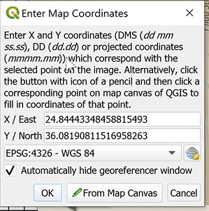
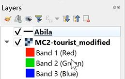

```{r setup, include=FALSE}
knitr::opts_chunk$set(echo = FALSE)
```

## Response to VAST Challenge quesions

In this section, we will employ appropriate visually driven data analysis techniques to answer the questions in the challenge. We will also explore the various packages required to build the plots. The criteria for selection of plots are as follows:
    - Level of customization 
    - Ease of use and implementation of customization 
    - Ease of understanding and interpretation of the plot- both clarity and aesthetic
    - Interactivity

### Qn 1- Using just the credit and loyalty card data, identify the most popular locations, and when they are popular. What anomalies do you see? What corrections would you recommend to correct these anomalies?

Based on the interactive charts below, the top 3 most popular locations by transaction volume are listed below:

* Loyalty card spending*

Ranking   | Location            | Popular Date      
------------------------------------------------
1         | Katerina's Cafe     | 01/11/2014  
2         | Hippokampos         | 01//2014   
3         | Guy's Gyros         | 01//2014   

* Credit card spending*

Ranking   | Location            | Date        
-----------------------------------------------
1         | Katerina's Cafe     | 01/11/2014  
2         | Hippokampos         | 01//2014    
3         | Guy's Gyros         | 01//2014     

```{r}
## Volume from loyalty card dataset- not linked
loyalty_data_loc_vol <- loyalty_data_cleaned %>%
  group_by(location) %>%
  summarise(txn_count = n()) %>%
  arrange(desc(txn_count))

loyalty_loc_vol_bar <- plot_ly(loyalty_data_loc_vol, x = ~txn_count, y = ~location, type = "bar", hoverinfo = "text", 
                       text = ~paste("Transaction Volume:", loyalty_data_loc_vol$txn_count)) %>% 
                      layout(title = "Loyalty card transaction Volume by Location", 
                             xaxis = list(title = "Transaction Volume", zeroline = FALSE), 
                             yaxis = list(title = "Location", zeroline = FALSE, categoryorder = "array", dtick= 1, categoryarray = ~txn_count))

loyalty_loc_vol_bar

library(crosstalk)

loyalty_data_count <- loyalty_data_cleaned %>%
  group_by(location, date) %>%
  summarise(txn_count = n()) %>%
  arrange(desc(txn_count))

loyalty_data_count %>% 
  SharedData$new(key = ~location) %>%
  plot_ly(x = ~date, y = ~txn_count, hoverinfo = "text", 
              text = ~paste("Location:", location,"<br>",
                            "Date:", date,"<br>",
                            "Transaction Count:", txn_count), alpha = 0.5) %>%
          group_by(location) %>%
          add_lines()

```

```{r}
## Volume from loyalty card dataset by date- linked

library(crosstalk)

shared_data <- SharedData$new(loyalty_data_cleaned, key = ~location)

loyalty_loc_vol_bar <- shared_data %>%
  plot_ly() %>% 
  group_by(location) %>%
  summarise(txn_count = n()) %>%
  arrange(desc(txn_count)) %>%
  add_bars(x = ~txn_count, y = ~location, type = "bar", hoverinfo = "text", 
          text = ~paste("Location:", location,
                        "<br>Transaction Volume:", txn_count)) %>%
  layout(title = "Loyalty card transaction Volume by Location", xaxis = list(title = "Transaction Volume", 
         zeroline = FALSE), yaxis = list(title = "Location", zeroline = FALSE, categoryorder = "array", dtick= 1, categoryarray = ~txn_count))

loyalty_loc_vol_line <- shared_data %>% 
  plot_ly() %>%
  group_by(location, date) %>%
  summarise(txn_count = n()) %>%
  add_lines(x = ~date, y = ~txn_count, hoverinfo = "text", 
          text = ~paste("Location:", location,
                        "<br>Date:", date,
                        "<br>Transaction Volume:", txn_count)) %>%
  layout(xaxis = list(title = "Date", showgrid = TRUE, showticklabels = TRUE), 
         yaxis = list(title = "Transaction volume"))

bscols(widths = c(14,14), loyalty_loc_vol_bar, loyalty_loc_vol_line)
```

```{r}
## Volume from credit card dataset by date- linked

cc_data_loc_vol <- cc_data_cleaned %>%
  group_by(location) %>%
  summarise(txn_count = n()) %>%
  arrange(desc(txn_count))

cc_loc_vol_bar <- plot_ly(cc_data_loc_vol, x = ~txn_count, y = ~location, type = "bar", hoverinfo = "text", 
                       text = ~paste("Transaction Volume:", cc_data_loc_vol$txn_count)) %>% 
                      layout(title = "Credit card transaction Volume by Location", xaxis = list(title = "Transaction Volume", 
                      zeroline = FALSE), yaxis = list(title = "Location", zeroline = FALSE, dtick= 1, categoryorder = "array", categoryarray = ~txn_count))

cc_loc_vol_bar


```
When comparing both datasets, I also noted that there are differences in the transaction count on the loyalty card and credit card. In particular, there were days where loyalty card transactions were higher than credit card transactions. This is unexpected as loyalty card is used to collect discounts and rewards and cannot be used for payment. Hence one would expect both volumes to either be the same or for credit card volumes (actual purchase) to be higher than loyalty card volumes (in cases where the employee may have forgotten to present loyalty card for rewards/ discounts). The difference in volumes each day across both cards are illustrated below.

```{r}
## Difference in volume by day

loyalty_data_count <- loyalty_data_cleaned %>%
  group_by(location, date) %>%
  summarise(txn_count = n()) %>%
  arrange(desc(txn_count))

cc_data_count <- cc_data_cleaned %>%
  group_by(location, date) %>%
  summarise(txn_count = n()) %>%
  arrange(desc(txn_count))

count_loyalty_cc_comb <- loyalty_data_count %>%
  full_join(cc_data_count, by = c("location","date")) %>%
  rename("loyalty_card_txncount" = "txn_count.x", "credit_card_txncount" = "txn_count.y") %>%
  mutate_if(is.numeric , replace_na, replace = 0) %>%
  mutate(difference_vol = loyalty_card_txncount - credit_card_txncount) 

a <- list(
  title = "Difference in spending between Credit card and Loyalty card per day by location",
  showticklabels = TRUE
)

txn_vol_difference_heatmap <- count_loyalty_cc_comb %>%
  plot_ly(height = 600, x= ~date, y = ~location , z = ~difference_vol, colors = brewer.pal(3, "Blues"), type = "heatmap",   hoverinfo = 'text',
          text = ~paste("Date:", date,
                        "<br> Location:", location,
                        "<br> Vol_Diference:", difference_vol))
txn_vol_difference_heatmap %>% layout(yaxis = a, xaxis = list(
  dtick = "86400000.0",
  type = 'date',
  title = "Date",
  tickangle = 0,
  tickformat = "%d%b"), margin = m, plot_bgcolor="#bdbdbd")
```
We will then analyze the transaction volume by day of week to observe volume trends across the week.

* Loyalty card spending*

Ranking   | Location            | Popular Day of Week
--------------------------------------------------
1         | Katerina's Cafe     | Tue, Thu, Sat
2         | Hippokampos         | Mon, Wed, Thu
3         | Guy's Gyros         | Mon, Thu, Fri


```{r}
## Loyalty card volume by day of week

## Preparing the data
loyalty_data_cleaned$daynumber = lubridate::wday(loyalty_data_cleaned$date, week_start = 1)
loyalty_data_cleaned$weekday = weekdays(loyalty_data_cleaned$date)
loyalty_data_cleaned$weekday = factor(loyalty_data_cleaned$weekday, levels= c("Sunday", "Monday", 
                                             "Tuesday", "Wednesday", "Thursday", "Friday", "Saturday"))

## Plots
shared_data_loyalty = SharedData$new(loyalty_data_cleaned, key = ~ location)

loyalty_wkday_vol <- shared_data_loyalty %>%
  plot_ly( width=1400, height=200) %>%
  group_by(weekday,location) %>%
  summarize(transaction = n()) %>%
  arrange(desc(transaction)) %>%
  add_trace(x = ~weekday, y = ~transaction, color = ~location, type = 'bar',hoverinfo = 'text',
            hovertext  = ~paste("<br> Day_of_week:", weekday,
                          "<br> Transaction Volume:", transaction)) %>%
  layout(xaxis = list(title = "Day_of_week", 
                        type = "factor",
                        categoryorder = "factor",
                        categoryarray = loyalty_data_cleaned$weekday[order(loyalty_data_cleaned[['daynumber']])],
                        showgrid = TRUE,
                        showticklabels = TRUE
                      ), yaxis = list(title = "Transaction volume"))

bscols(widths = c(10,4),
  list(
    filter_select("location", "Please Specify the location", shared_data_loyalty, group =  ~location, multiple = F),
    datatable(shared_data_loyalty)
  ),
  loyalty_wkday_vol
)
```
Given that we are provided with credit card timestamp information, we will take one step further to analyze the volume of credit card transactions by location and time.

* Credit card spending*

Ranking   | Location            | Popular Day of Week   | Popular Time
---------------------------------------------------------------------------------------------------------
1         | Katerina's Cafe     | Mon, Tue, Sat         | 1700-2000 across weekday and weekends
2         | Hippokampos         | Mon, Wed, Thu         | Most popular on 1300-1600 on weekdays and 1700-2000 on weekends
3         | Guy's Gyros         | Mon, Thu, Fri         | 1700-2000 across weekday and weekends except for Friday where 1300-1600 is most popular

```{r}
## Credit card volume by day of week
## Loading data
Sys.setlocale("LC_TIME", "English")
## Preparing the data
cc_data_cleaned$daynumber = lubridate::wday(cc_data_cleaned$timestamp, week_start = 1)
cc_data_cleaned$weekday = weekdays(cc_data_cleaned$timestamp)
cc_data_cleaned$weekday = factor(cc_data_cleaned$weekday, levels= c("Sunday", "Monday", 
                                             "Tuesday", "Wednesday", "Thursday", "Friday", "Saturday"))
## Preparing timegroup
cc_data_cleaned$timegroup = ""
cc_data_cleaned$timegroup[cc_data_cleaned$hour < 05 & 00 <= cc_data_cleaned$hour] = "00 - 04"
cc_data_cleaned$timegroup[cc_data_cleaned$hour < 09 & 05 <= cc_data_cleaned$hour] = "05 - 08"
cc_data_cleaned$timegroup[cc_data_cleaned$hour < 13 & 09 <= cc_data_cleaned$hour] = "09 - 12"
cc_data_cleaned$timegroup[cc_data_cleaned$hour < 17 & 13 <= cc_data_cleaned$hour] = "13 - 16"
cc_data_cleaned$timegroup[cc_data_cleaned$hour < 21 & 17 <= cc_data_cleaned$hour] = "17 - 20"
cc_data_cleaned$timegroup[cc_data_cleaned$hour <= 24 & 21 <= cc_data_cleaned$hour] = "21 - 24"

## Plots
shared_data = SharedData$new(cc_data_cleaned, key = ~ location)

cc_wkday_vol <- shared_data %>%
  plot_ly( width=1400, height=200) %>%
  group_by(weekday,location) %>%
  summarize(transaction = n()) %>%
  arrange(desc(transaction)) %>%
  add_trace(x = ~weekday, y = ~transaction, color = ~location, type = 'bar',hoverinfo = 'text',
            hovertext  = ~paste("<br> Day_of_week:", weekday,
                          "<br> Transaction Volume:", transaction)) %>%
  layout(xaxis = list(title = "Day_of_week", 
                        type = "factor",
                        categoryorder = "factor",
                        categoryarray = cc_data_cleaned$weekday[order(cc_data_cleaned[['daynumber']])],
                        showgrid = TRUE,
                        showticklabels = TRUE
                      ), yaxis = list(title = "Transaction volume"))

cc_timegroup_vol <-shared_data %>%
  plot_ly( width=800, height=200) %>%
  group_by(weekday,timegroup,location) %>%
  summarize("transaction" = n()) %>%
  add_trace(x = ~weekday, y = ~transaction, color = ~timegroup, type = 'bar',hoverinfo = 'text',
            hovertext  = ~paste("<br> Time:", timegroup,
                                "<br>Transaction Volume:", transaction)) %>%
  layout(xaxis = list(title = "Time",  type = "factor",
                      categoryorder = "factor",
                      categoryarray = cc_data_cleaned$weekday[order(cc_data_cleaned[['daynumber']])],
                      showgrid = TRUE,
                      showticklabels = TRUE
                      ), yaxis = list(title = "Transaction volume"))


bscols(widths = c(10,4),
  list(
    filter_select("location", "Please Specify the location", shared_data, group =  ~location, multiple = F),
    datatable(shared_data)
  ),
  cc_wkday_vol,
  cc_timegroup_vol
)
```

As observed above, popular day of week differs for some of the locations such as Katerina's Cafe. This is unexpected as we would expect the trends to be similar for both cards.

Also, based on the timestamp of credit card transactions, we noted that all of the transactions in "Bean There Done That", "Brewed Awakenings", "Coffee Shack" and "Jack's Magical Beans" during the period of transactions- 12:00pm. It is highly unlikely that all transactions in these locations are transacted at the same time. Hence, the timestamp for these transactions may be incorrect.

Given that these timestamps may not be representative of the actual transaction time, we will not be using this information for further analysis subsequently.

```{r}
cc_data_incorrect_time <- cc_data_cleaned %>%
  filter(location == "Bean There Done That" |location == "Brewed Awakenings" |location == "Coffee Shack" |location == "Jack's Magical Beans")

cc_data_incorrect_time$day_of_wk <- as.character(cc_data_incorrect_time$day_of_wk)
cc_data_incorrect_time$timestamp <- as.character(cc_data_incorrect_time$timestamp)

cc_data_incorrect_time = subset(cc_data_incorrect_time, select = -c(day_of_wk, timegroup, day, hour, daynumber, weekday))

DT::datatable(cc_data_incorrect_time, options = list(pageLength = 10, width="100%"))
```

Furthermore, we also noted that there are several transactions in Kronos Mart at 3am on 13 January and 19 January. This is highly unusual and warrants further investigation.

Other anomalies noted from the data are as follows:

1) As seen in the datatables below, there are 55 credit cards but only 54 loyalty card spending information provided. This is unusual as all employees are provided with a loyalty card. This discrepancy may arise because the employee does not want his/ her movement to be tracked and hence is avoiding using the loyalty card, or that employees are using more than 1 credit card for their purchases.

```{r}
distinct_loyalty <- loyalty_data_cleaned  %>%
  group_by(loyaltynum) %>%
  summarize(total_spent = sum(price)) %>%
  arrange(desc(total_spent))

DT::datatable(distinct_loyalty, filter = 'top', class = 'cell-border stripe', options = list(columnDefs = list(list(className = 'dt-center', targets = 0:2, width = '20%')))) %>%
  formatStyle(0, target = 'row', lineHeight = '50%')

distinct_cc <- cc_data_cleaned  %>%
  group_by(last4ccnum) %>%
  summarize(total_spent = sum(price)) %>%
  arrange(desc(total_spent))

DT::datatable(distinct_cc, filter = 'top', class = 'cell-border stripe', options = list( columnDefs = list(list(className = 'dt-center', targets = 0:2, width = '20%')))) %>%
  formatStyle(0, target = 'row', lineHeight = '50%')
```

```{r}
#Reconsider this
#Boxplot of credit card and loyalty card spending
cc_data_cleaned_highlight <- highlight_key(cc_data_cleaned)
boxplot_loyalty_grpcard <- plot_ly(cc_data_cleaned_highlight, x = ~price, y = ~last4ccnum) %>% 
  add_boxplot(x = ~price, y = ~last4ccnum, hoverinfo = "text",
              hovertext = ~paste("Location:", location,"<br>",
                        "Date:", date,"<br>",
                        "Amount:", price)) %>%
  layout(boxmode = "group",xaxis = list(title = 'Credit card spending by card', tickangle = 0, ticks = "outside", ticklen = 2, tickwidth = 2, tickcolor = toRGB("black"), showgrid = T, autorange = T, showticklabels = TRUE, zeroline = F,  showline = F, type = "log"),  margin = m, yaxis = list(dtick= 1)) 

boxplot_loyalty_grpcard_int <- highlight(ggplotly(boxplot_loyalty_grpcard), "plotly_selected")

crosstalk::bscols(boxplot_loyalty_grpcard_int,DT::datatable(cc_data_cleaned_highlight), widths = 12)
```

2)  Timestamp data in credit card data set was provided in the datetime format while timestamp data in loyalty card data set was in the date format. This made it harder to compare between both datasets, In order to overcome this, I grouped the credit card data by date so as to align the information with that in the loyalty card dataset for comparability.

### Qn 2- Add the vehicle data to your analysis of the credit and loyalty card data. How does your assessment of the anomalies in question 1 change based on this new data? What discrepancies between vehicle, credit, and loyalty card data do you find? 

Assuming that the car assignment list provided includes all employees, we noted that there are 44 distinct employees. However, we noted that there are 55 distinct credit card numbers and 54 distinct loyalty card numbers. This is unusual as each employee should have been issued a loyalty card and hence we would expect number of distinct credit cards, loyalty cards and employee count to match.

More investigation should be made into this discrepancy. One explanation could be that employees could have used more than one credit card with their loyalty card. Another explanation could be that there is a new employee who has not received the loyalty card. Given that the employee count is different from number of distinct loyalty cards, we should check with Gastech if there are any employees missing from this list.

```{r}
distinct_empname <- location_carid_join  %>%
  group_by(FirstName, LastName) %>%
  summarize(mean = mean(hour)) %>%
  drop_na(FirstName)

distinct_empname <- data.frame(distinct_empname)
distinct_empname <- subset(distinct_empname, select = -c(mean))

DT::datatable(distinct_loyalty, caption = "Distinct loyalty card numbers", filter = 'top', class = 'cell-border stripe', options = list(columnDefs = list(list(className = 'dt-center', targets = 0:2, width = '20%')))) %>%
  formatStyle(0, target = 'row', lineHeight = '50%')

DT::datatable(distinct_cc, caption = "Distinct credit card numbers", filter = 'top', class = 'cell-border stripe', options = list( columnDefs = list(list(className = 'dt-center', targets = 0:2, width = '20%')))) %>%
  formatStyle(0, target = 'row', lineHeight = '50%')

DT::datatable(distinct_empname, caption = "Distinct employee names", filter = 'top', options = list(columnDefs = list(list(className = 'dt-center', targets = 0:3, autoWidth = TRUE, scrollX = TRUE))))

```

From the car assignment dataset provided, we observe that there are nine truck drivers with no ID. This is consistent with what Gastech has explained, which is that employees who do not have company cars have the ability to check out company trucks for business use, but these trucks cannot be used for personal business.

The case scenario does not state which CarIDs are referring to trucks. However, assuming that the 3 digit CarID represents trucks, we only note GPS data for five trucks. There is no evidence as to whether the truck ID is sequential or if each truck driver is assigned to a truck. Given that there are 9 truck drivers and only 5 truck GPS data provided, there is possibility that:
1) Each truck driver is not assigned to a unique truck and trucks can be shared.
2) There are 4 GPS paths missing in the GPS dataset

To perform further investigation on this, we will plot the GPS paths of each carID over the Abila map to identify their route.

```{r}
missing_carid <- location_carid_join  %>%
  group_by(id) %>%
  filter(is.na(id))
missing_carid = subset(missing_carid, select = -c(lat,long,date,day,hour))

DT::datatable(missing_carid, caption = "Truck Driver with no assigned car", filter = 'top', options = list(autoWidth = TRUE, scrollX = TRUE))

missing_empname <- location_carid_join  %>%
  group_by(id, FirstName, LastName) %>%
  filter(is.na(FirstName)| is.na(LastName)) %>%
  select(id) %>%
  unique()

DT::datatable(missing_empname, caption = "CarID with no assigned employee", filter = 'top', options = list(columnDefs = list(list(className = 'dt-center', targets = 0:3, width = '25%'))))
```

*Working with geospatial data*

### Georeferencing

1. Download and launch QGIS, an open-sourced GIS software. 

2. Start a new project by clicking on Project> New. 


3. Add a vector layer. Navigate to Add Layer > Add Layer > Add Vector Layer


4. Click on the "..." button and navigate to location of Abula.shp file. Click on Add. You should see Figure 6 in your main pane.


5. To make the map clearer, we will then change the lines from green to black. Right click on Abila under the layers panel > select Properties > select Symbology > click on the arrow dropdown next to Color and select black > Click Apply and Ok.


6. To perform the georeferencing, click on Raster on the top pane > Georeferencer. When the new window appears, click on the blue square symbol on the top left to access the image file. Navigate to the MC2- tourist JPG file. In order to perform georeferencing, we need to select reference points (at least 6 control points) from the tourist map to match to the corresponding points on the SHP file map.


7. To match the corresponding points, click on the identify tool on the top pane. Hover over the suspected corresponding point and click on it. The Identify Results pane appears on the right corner. Observe the results by matching the road name specified on the Identify Results pane to the tourist map.


8. Once checked to be correct, under the Georeferencer, click on the selected point on the tourist map. On the Enter Map Coordinates window that appears, click on From Map Canvas and hover over the Shp file map. Ensure the crosshair is as close as possible to the actual point. By clicking on the point, this captures the X and Y coordinates. Click Ok. The GCP table in the Georeferencer window will be updated with the first reference point. Repeat the above steps for the other cross-reference points.





9. To check the settings, select Settings > Transformation Settings. Select the following settings as specified in Figure 17. Note that if the Target SRS is not set to WGS 84, click on the globe symbol next to the field and type "4326" under the filter pane. Select WGS 84 when it appears as the filtered result. Under output settings, ensure results are saved in a TIF file format for usage subsequently. Click on the tickbox next to "Save GCP points" and "Load in QGIS when done". Click ok.


10. Select file on the top pane > select Start Georeferencing. Once georeferencing is completed, minimise the georeferencer pane and switch back to the map.


11. Under the layers pane on the left, drag the image file below the Abila streetmap so that the streetmap can be plotted on top of the tourist map. Doing a check, we observe that the streetmap is well-aligned with the image file. The TIF file created can then be used in RStudio as a raster object.




After preparing the georeferencing, we will then import the raster layer into RStudio.
```{r}
# Import raster layer
bgmap <- raster("data/Geospatial/MC2-tourist.tif")
bgmap

tmap_mode("plot")
tm_shape(bgmap) +
  tm_rgb(bgmap, r = 1, g = 2, b = 3, alpha = NA, saturation = 1, interpolate = TRUE, max.value = 255)
```

Using st_read() of sf package, import Abila shapefile into R. We will then convert aspatial data to simple feature dataframe
```{r}
# Import line data
Abila_st <- st_read(dsn = "data/Geospatial", layer = "Abila")

# Converting gps data to Simple Feature Data Frame
gps_data <- gps_data %>%
  mutate(day = get_day(gps_data$Timestamp), date = as_date(gps_data$Timestamp), minute = get_minute(gps_data$Timestamp), day_of_week = as_weekday(gps_data$Timestamp), hour = get_hour(gps_data$Timestamp)) 

gps_data$timegroup = cut(gps_data$hour,c(0,4,8,12,16,20,24))
levels(gps_data$timegroup) = c("0-4","5-8","8-12","13-16","17-20","21-24")
gps_data

gps_sf <- st_as_sf(gps_data,
                   coords = c("long", "lat"),
                   crs = 4326)
```

Next, join the gps points into movement paths by using the drivers' IDs as unique identifiers.
```{r}
# Creating movement path from GPS points
## Group by need to come with summarize--> in this case we summarize using mean timestamp but this value is not needed
gps_path <- gps_sf %>%
  group_by(id, day, timegroup, hour) %>%
  summarize(m = mean(Timestamp), do_union = FALSE) %>%
  st_cast("LINESTRING")
```

Checking the data, we noticed single coordinates pair in the line feature. The following code chunk is to identify and remove the orphan lines.
```{r}
# Remove one point linestrings
library(mapview)

points = npts(gps_path, by_feature = TRUE)
gps_path <- cbind(gps_path, points)
gps_path_cleaned <-gps_path[!(gps_path$points== 1),]

```

Lastly, we then overplot the selected gps path onto the background tourist map.
```{r}
# Plotting GPS paths
gps_path_selected <- gps_path_cleaned %>%
  filter(id == 1, day == 6)

tmap_mode("view")
tm_shape(bgmap) +
  tm_rgb(bgmap, r = 1, g = 2, b = 3, alpha = NA, saturation = 1, interpolate = TRUE, max.value = 255) +
  tm_shape(gps_path_selected) +
  tm_lines(col= "red")

```

By plotting the GPS coordinates using the Abila tourist map as background, we are able to visualize the path each vehicle is using. The map is also interactive. Clicking on any point in the trajectory allows us to see the CarID, day and timestamp of the respective route. This allows us to match the timestamp and location back to the credit card dataset, hence matching the credit card numbers to their corresponding CarID.

We have used a facet map below to visualize the daily route for CarID 1 across each of the 14 days of GPS data in record. This allows for easy obervation and matching to the credit card data.

```{r}
# Facet map
gps_path_selected <- gps_path_cleaned %>%
  filter(id == 1)
  
tmap_mode("view")
tm_shape(bgmap) +
  tm_rgb(bgmap, r = 1, g = 2, b = 3, alpha = NA, saturation = 1, interpolate = TRUE, max.value = 255) +
  tm_shape(gps_path_selected) +
  tm_lines(col= "red") +
  tm_facets(by = "day", ncol = 3)

```

After mapping the GPS trajectories, We also noted that there were no GPS data indicating that any car stopped near "Bean There Done That", "Brewed Awakenings", "Coffee Shack" and "Jack's Magical Beans" during the period of transactions- 12:00pm. Hence, these transactions are either incorrectly timed or may even be fraudulent.

```{r}
# Facet map
gps_path_selected <- gps_path_cleaned %>%
  filter(hour == 12)
  
tmap_mode("view")
tm_shape(bgmap) +
  tm_rgb(bgmap, r = 1, g = 2, b = 3, alpha = NA, saturation = 1, interpolate = TRUE, max.value = 255) +
  tm_shape(gps_path_selected) +
  tm_lines() +
  tm_facets(by = "id", ncol = 3)
```

Furthermore as mentioned above, we also noted that there are several transactions in Kronos Mart at 3am on 13 January and 19 January. By filtering the map for 3am, we noted that there were no cars near Kronos Mart. Hence, these transactions are either incorrectly timed or may even be fraudulent.

```{r}
# Facet map
gps_path_selected <- gps_path_cleaned %>%
  filter(hour == 3)
  
tmap_mode("view")
tm_shape(bgmap) +
  tm_rgb(bgmap, r = 1, g = 2, b = 3, alpha = NA, saturation = 1, interpolate = TRUE, max.value = 255) +
  tm_shape(gps_path_selected) +
  tm_lines() +
  tm_facets(by = "id", ncol = 3)
```


