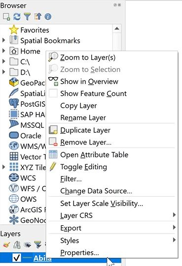
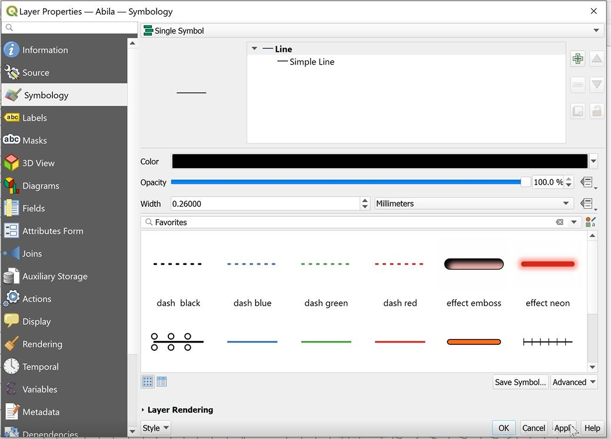
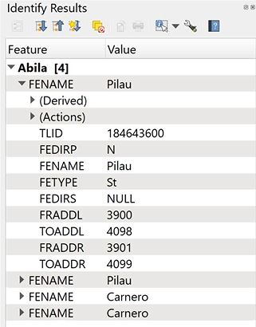
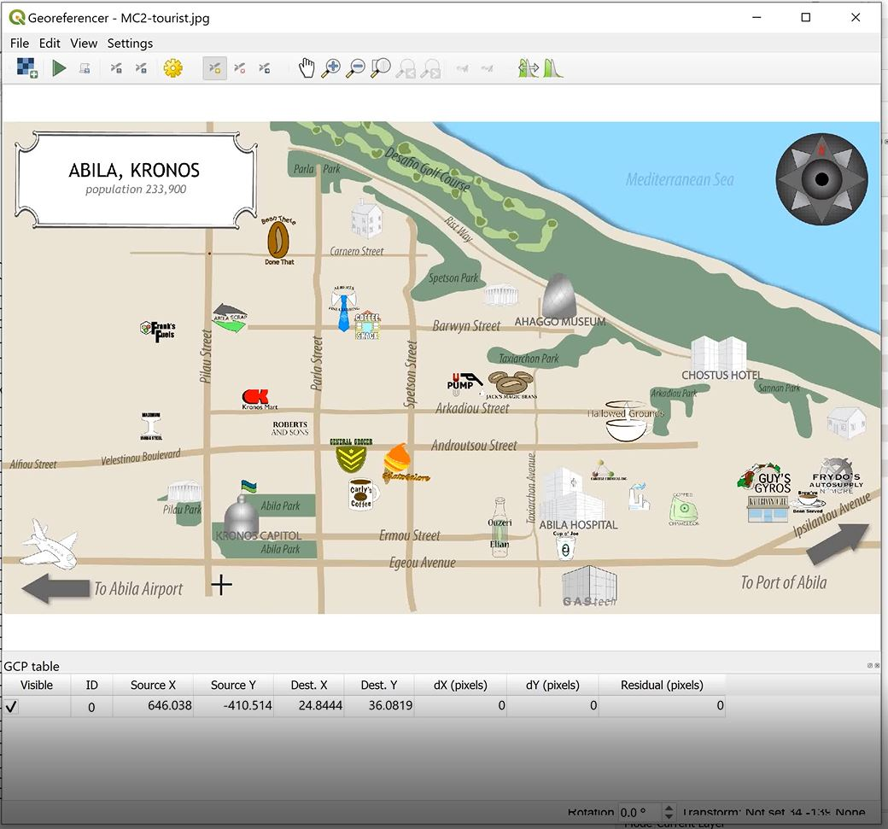
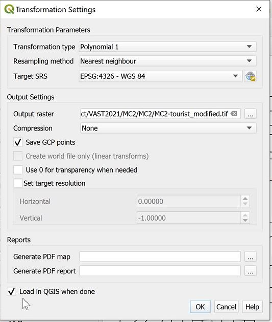

<style>

body{
  background-color: #EBEDEF;
  font-family:helvetica;
}
</style>

```{r setup, include=FALSE}
knitr::opts_chunk$set(fig.retina = 3,
                      echo = FALSE,
                      eval = TRUE,
                      message = FALSE,
                      warning = FALSE)
```

## Response to VAST Challenge quesions

In this section, we will employ appropriate visually driven data analysis techniques to answer the questions in the challenge. We will also explore the various packages required to build the plots. The criteria for selection of plots are as follows:
    - Level of customization 
    - Ease of use and implementation of customization 
    - Ease of understanding and interpretation of the plot- both clarity and aesthetic
    - Interactivity

### Qn 1- Using just the credit and loyalty card data, identify the most popular locations, and when they are popular. What anomalies do you see? What corrections would you recommend to correct these anomalies?

Based on the interactive charts below, the top 3 most popular locations by transaction volume are listed below:

*Loyalty card spending*

Ranking   | Location            | Popular Date      
------------------------------------------------
1         | Katerina's Cafe     | 01/11/2014  
2         | Hippokampos         | 01//2014   
3         | Guy's Gyros         | 01//2014   

*Credit card spending*

Ranking   | Location            | Date        
-----------------------------------------------
1         | Katerina's Cafe     | 01/11/2014  
2         | Hippokampos         | 01//2014    
3         | Guy's Gyros         | 01//2014     

```{r}
##Volume from loyalty card dataset- not linked
loyalty_data_loc_vol <- loyalty_data_cleaned %>%
  group_by(location) %>%
  summarise(txn_count = n()) %>%
  arrange(desc(txn_count))

loyalty_loc_vol_bar <- plot_ly(loyalty_data_loc_vol, x = ~txn_count, y = ~location, type = "bar", hoverinfo = "text", 
                       text = ~paste("Transaction Volume:", loyalty_data_loc_vol$txn_count)) %>% 
                      layout(title = "Loyalty card transaction Volume by Location", 
                             xaxis = list(title = "Transaction Volume", zeroline = FALSE), 
                             yaxis = list(title = "Location", zeroline = FALSE, categoryorder = "array", dtick= 1, categoryarray = ~txn_count))

loyalty_loc_vol_bar

library(crosstalk)

loyalty_data_count <- loyalty_data_cleaned %>%
  group_by(location, date) %>%
  summarise(txn_count = n()) %>%
  arrange(desc(txn_count))

loyalty_data_count %>% 
  SharedData$new(key = ~location) %>%
  plot_ly(x = ~date, y = ~txn_count, hoverinfo = "text", 
              text = ~paste("Location:", location,"<br>",
                            "Date:", date,"<br>",
                            "Transaction Count:", txn_count), alpha = 0.5) %>%
          group_by(location) %>%
          add_lines()

```

```{r}
##Volume from loyalty card dataset by date- linked

library(crosstalk)

shared_data <- SharedData$new(loyalty_data_cleaned, key = ~location)

loyalty_loc_vol_bar <- shared_data %>%
  plot_ly() %>% 
  group_by(location) %>%
  summarise(txn_count = n()) %>%
  arrange(desc(txn_count)) %>%
  add_bars(x = ~txn_count, y = ~location, type = "bar", hoverinfo = "text", 
          text = ~paste("Location:", location,
                        "<br>Transaction Volume:", txn_count)) %>%
  layout(title = "Loyalty card transaction Volume by Location", xaxis = list(title = "Transaction Volume", 
         zeroline = FALSE), yaxis = list(title = "Location", zeroline = FALSE, categoryorder = "array", dtick= 1, categoryarray = ~txn_count))

loyalty_loc_vol_line <- shared_data %>% 
  plot_ly() %>%
  group_by(location, date) %>%
  summarise(txn_count = n()) %>%
  add_lines(x = ~date, y = ~txn_count, hoverinfo = "text", 
          text = ~paste("Location:", location,
                        "<br>Date:", date,
                        "<br>Transaction Volume:", txn_count)) %>%
  layout(xaxis = list(title = "Date", showgrid = TRUE, showticklabels = TRUE), 
         yaxis = list(title = "Transaction volume"))

bscols(widths = c(14,14), loyalty_loc_vol_bar, loyalty_loc_vol_line)
```

```{r}
##Volume from credit card dataset by date- linked

cc_data_loc_vol <- cc_data_cleaned %>%
  group_by(location) %>%
  summarise(txn_count = n()) %>%
  arrange(desc(txn_count))

cc_loc_vol_bar <- plot_ly(cc_data_loc_vol, x = ~txn_count, y = ~location, type = "bar", hoverinfo = "text", 
                       text = ~paste("Transaction Volume:", cc_data_loc_vol$txn_count)) %>% 
                      layout(title = "Credit card transaction Volume by Location", xaxis = list(title = "Transaction Volume", 
                      zeroline = FALSE), yaxis = list(title = "Location", zeroline = FALSE, dtick= 1, categoryorder = "array", categoryarray = ~txn_count))

cc_loc_vol_bar
```

When comparing both datasets, I also noted that there are differences in the transaction count on the loyalty card and credit card. In particular, there were days where loyalty card transactions were higher than credit card transactions. This is unexpected as loyalty card is used to collect discounts and rewards and cannot be used for payment. Hence one would expect both volumes to either be the same or for credit card volumes (actual purchase) to be higher than loyalty card volumes (in cases where the employee may have forgotten to present loyalty card for rewards/ discounts). The difference in volumes each day across both cards are illustrated below.

```{r}
##Difference in volume by day

loyalty_data_count <- loyalty_data_cleaned %>%
  group_by(location, date) %>%
  summarise(txn_count = n()) %>%
  arrange(desc(txn_count))

cc_data_count <- cc_data_cleaned %>%
  group_by(location, date) %>%
  summarise(txn_count = n()) %>%
  arrange(desc(txn_count))

count_loyalty_cc_comb <- loyalty_data_count %>%
  full_join(cc_data_count, by = c("location","date")) %>%
  rename("loyalty_card_txncount" = "txn_count.x", "credit_card_txncount" = "txn_count.y") %>%
  mutate_if(is.numeric , replace_na, replace = 0) %>%
  mutate(difference_vol = loyalty_card_txncount - credit_card_txncount) 

a <- list(
  title = "Difference in volume per day by location",
  showticklabels = TRUE
)

txn_vol_difference_heatmap <- count_loyalty_cc_comb %>%
  plot_ly(height = 800, width = 1000,  x= ~date, y = ~location , z = ~difference_vol, colors = brewer.pal(3, "Blues"), type = "heatmap",   hoverinfo = 'text',
          text = ~paste("Date:", date,
                        "<br> Location:", location,
                        "<br> Vol_Diference:", difference_vol))
txn_vol_difference_heatmap %>% layout(yaxis = a, xaxis = list(
  dtick = "86400000.0",
  type = 'date',
  title = "Date",
  tickangle = 0,
  tickformat = "%d%b"), margin = m, plot_bgcolor="#bdbdbd")
```
We will then analyze the transaction volume by day of week to observe volume trends across the week.

* Loyalty card spending*

Ranking   | Location            | Popular Day of Week
--------------------------------------------------
1         | Katerina's Cafe     | Tue, Thu, Sat
2         | Hippokampos         | Mon, Wed, Thu
3         | Guy's Gyros         | Mon, Thu, Fri

```{r}
##Loyalty card volume by day of week

##Preparing the data
loyalty_data_cleaned$daynumber = lubridate::wday(loyalty_data_cleaned$date, week_start = 1)
loyalty_data_cleaned$weekday = factor(loyalty_data_cleaned$weekday, levels= c("Sunday", "Monday", 
                                             "Tuesday", "Wednesday", "Thursday", "Friday", "Saturday"))

loyalty_data_cleaned$date = as.character(loyalty_data_cleaned$date)

##Plots
shared_data_loyalty = SharedData$new(loyalty_data_cleaned, key = ~ location)

loyalty_wkday_vol <- shared_data_loyalty %>%
  plot_ly( width=300, height=200) %>%
  group_by(weekday,location) %>%
  summarize(transaction = n()) %>%
  arrange(desc(transaction)) %>%
  add_trace(x = ~weekday, y = ~transaction, color = ~location, type = 'bar',hoverinfo = 'text',
            hovertext  = ~paste("<br> Day_of_week:", weekday,
                          "<br> Transaction Volume:", transaction)) %>%
  layout(xaxis = list(title = "Day_of_week", 
                        type = "factor",
                        categoryorder = "factor",
                        categoryarray = loyalty_data_cleaned$weekday[order(loyalty_data_cleaned[['daynumber']])],
                        showgrid = TRUE,
                        showticklabels = TRUE
                      ), yaxis = list(title = "Transaction volume"))

bscols(widths = c(10,4),
  list(
    filter_select("location", "Please Specify the location", shared_data_loyalty, group =  ~location, multiple = F),
    datatable(shared_data_loyalty)
  ),
  loyalty_wkday_vol
)
```
Given that we are provided with credit card timestamp information, we will take one step further to analyze the volume of credit card transactions by location and time.

* Credit card spending*

Ranking   | Location            | Popular Day of Week   | Popular Time
---------------------------------------------------------------------------------------------------------
1         | Katerina's Cafe     | Mon, Tue, Sat         | 1700-2000 across weekday and weekends
2         | Hippokampos         | Mon, Wed, Thu         | Most popular on 1300-1600 on weekdays and 1700-2000 on weekends
3         | Guy's Gyros         | Mon, Thu, Fri         | 1700-2000 across weekday and weekends except for Friday where 1300-1600 is most popular

```{r}
## Credit card volume by day of week
## Loading data
Sys.setlocale("LC_TIME", "English")
## Preparing the data
cc_data_cleaned$daynumber = lubridate::wday(cc_data_cleaned$timestamp, week_start = 1)
cc_data_cleaned$weekday = factor(cc_data_cleaned$weekday, levels= c("Sunday", "Monday", 
                                             "Tuesday", "Wednesday", "Thursday", "Friday", "Saturday"))
cc_data_cleaned$timestamp = as.character(cc_data_cleaned$timestamp)

## Preparing timegroup
cc_data_cleaned$timegroup = ""
cc_data_cleaned$timegroup[cc_data_cleaned$hour < 05 & 00 <= cc_data_cleaned$hour] = "00 - 04"
cc_data_cleaned$timegroup[cc_data_cleaned$hour < 09 & 05 <= cc_data_cleaned$hour] = "05 - 08"
cc_data_cleaned$timegroup[cc_data_cleaned$hour < 13 & 09 <= cc_data_cleaned$hour] = "09 - 12"
cc_data_cleaned$timegroup[cc_data_cleaned$hour < 17 & 13 <= cc_data_cleaned$hour] = "13 - 16"
cc_data_cleaned$timegroup[cc_data_cleaned$hour < 21 & 17 <= cc_data_cleaned$hour] = "17 - 20"
cc_data_cleaned$timegroup[cc_data_cleaned$hour <= 24 & 21 <= cc_data_cleaned$hour] = "21 - 24"

## Plots
shared_data = SharedData$new(cc_data_cleaned, key = ~ location)

cc_wkday_vol <- shared_data %>%
  plot_ly( width=900, height=200) %>%
  group_by(weekday,location) %>%
  summarize(transaction = n()) %>%
  arrange(desc(transaction)) %>%
  add_trace(x = ~weekday, y = ~transaction, color = ~location, type = 'bar',hoverinfo = 'text',
            hovertext  = ~paste("<br> Day_of_week:", weekday,
                          "<br> Transaction Volume:", transaction)) %>%
  layout(xaxis = list(title = "Day_of_week", 
                        type = "factor",
                        categoryorder = "factor",
                        categoryarray = cc_data_cleaned$weekday[order(cc_data_cleaned[['daynumber']])],
                        showgrid = TRUE,
                        showticklabels = TRUE
                      ), yaxis = list(title = "Transaction volume"))

cc_timegroup_vol <-shared_data %>%
  plot_ly( width=300, height=200) %>%
  group_by(weekday,timegroup,location) %>%
  summarize("transaction" = n()) %>%
  add_trace(x = ~weekday, y = ~transaction, color = ~timegroup, type = 'bar',hoverinfo = 'text',
            hovertext  = ~paste("<br> Time:", timegroup,
                                "<br>Transaction Volume:", transaction)) %>%
  layout(xaxis = list(title = "Time",  type = "factor",
                      categoryorder = "factor",
                      categoryarray = cc_data_cleaned$weekday[order(cc_data_cleaned[['daynumber']])],
                      showgrid = TRUE,
                      showticklabels = TRUE
                      ), yaxis = list(title = "Transaction volume"))


bscols(widths = c(10,4),
  list(
    filter_select("location", "Please Specify the location", shared_data, group =  ~location, multiple = F),
    datatable(shared_data)
  ),
  cc_wkday_vol,
  cc_timegroup_vol
)
```

As observed above, popular day of week differs for some of the locations such as Katerina's Cafe. This is unexpected as we would expect the trends to be similar for both cards.

Also, based on the timestamp of credit card transactions, we noted that all of the transactions in "Bean There Done That", "Brewed Awakenings", "Coffee Shack" and "Jack's Magical Beans" during the period of transactions- 12:00pm. It is highly unlikely that all transactions in these locations are transacted at the same time. Hence, the timestamp for these transactions may be incorrect.

Given that these timestamps may not be representative of the actual transaction time, we will not be using this information for further analysis subsequently.

```{r}
cc_data_incorrect_time <- cc_data_cleaned %>%
  filter(location == "Bean There Done That" |location == "Brewed Awakenings" |location == "Coffee Shack" |location == "Jack's Magical Beans")

cc_data_incorrect_time$timestamp <- as.character(cc_data_incorrect_time$timestamp)

cc_data_incorrect_time = subset(cc_data_incorrect_time, select = -c(timegroup, day, hour, daynumber, weekday))

DT::datatable(cc_data_incorrect_time, options = list(pageLength = 10, width="100%"))
```

Furthermore, we also noted that there are several transactions in Kronos Mart at 3am on 13 January and 19 January. This is highly unusual and warrants further investigation.

Other anomalies noted from the data are as follows:

1) As seen in the datatables below, there are 55 credit cards but only 54 loyalty card spending information provided. This is unusual as all employees are provided with a loyalty card. This discrepancy may arise because the employee does not want his/ her movement to be tracked and hence is avoiding using the loyalty card, or that employees are using more than 1 credit card for their purchases.

```{r}
##loyalty card
distinct_loyalty <- loyalty_data_cleaned  %>%
  group_by(loyaltynum) %>%
  summarize(total_spent = sum(price)) %>%
  arrange(desc(total_spent))

DT::datatable(distinct_loyalty, filter = 'top', class = 'cell-border stripe', options = list(columnDefs = list(list(className = 'dt-center', targets = 0:2, width = '20%')))) %>%
  formatStyle(0, target = 'row', lineHeight = '50%')
```

```{r}
##credit card
distinct_cc <- cc_data_cleaned  %>%
  group_by(last4ccnum) %>%
  summarize(total_spent = sum(price)) %>%
  arrange(desc(total_spent))

DT::datatable(distinct_cc, filter = 'top', class = 'cell-border stripe', options = list( columnDefs = list(list(className = 'dt-center', targets = 0:2, width = '20%')))) %>%
  formatStyle(0, target = 'row', lineHeight = '50%')
```

2)  Timestamp data in credit card data set was provided in the datetime format while timestamp data in loyalty card data set was in the date format. This made it harder to compare between both datasets, In order to overcome this, I grouped the credit card data by date so as to align the information with that in the loyalty card dataset for comparability.

### Qn 2- Add the vehicle data to your analysis of the credit and loyalty card data. How does your assessment of the anomalies in question 1 change based on this new data? What discrepancies between vehicle, credit, and loyalty card data do you find? 

Assuming that the car assignment list provided includes all employees, we noted that there are 44 distinct employees. However, we noted that there are 55 distinct credit card numbers and 54 distinct loyalty card numbers. This is unusual as each employee should have been issued a loyalty card and hence we would expect number of distinct credit cards, loyalty cards and employee count to match.

More investigation should be made into this discrepancy. One explanation could be that employees could have used more than one credit card with their loyalty card. Another explanation could be that there is a new employee who has not received the loyalty card. Given that the employee count is different from number of distinct loyalty cards, we should check with Gastech if there are any employees missing from this list.

```{r}
##distinct employee names
distinct_empname <- location_carid_join  %>%
  group_by(FirstName, LastName) %>%
  summarize(mean = mean(hour)) %>%
  drop_na(FirstName)

distinct_empname <- data.frame(distinct_empname)
distinct_empname <- subset(distinct_empname, select = -c(mean))


DT::datatable(distinct_empname, caption = "Distinct employee names", filter = 'top', options = list(columnDefs = list(list(className = 'dt-center', targets = 0:3, autoWidth = TRUE, scrollX = TRUE))))
```

```{r}
##distinct loyalty cards
DT::datatable(distinct_loyalty, caption = "Distinct loyalty card numbers", filter = 'top', class = 'cell-border stripe', options = list(columnDefs = list(list(className = 'dt-center', targets = 0:2, width = '20%')))) %>%
  formatStyle(0, target = 'row', lineHeight = '50%')
```

```{r}
##distinct credit cards
DT::datatable(distinct_cc, caption = "Distinct credit card numbers", filter = 'top', class = 'cell-border stripe', options = list( columnDefs = list(list(className = 'dt-center', targets = 0:2, width = '20%')))) %>%
  formatStyle(0, target = 'row', lineHeight = '50%')
```

From the car assignment dataset provided, we observe that there are nine truck drivers with no ID. This is consistent with what Gastech has explained, which is that employees who do not have company cars have the ability to check out company trucks for business use, but these trucks cannot be used for personal business.

The case scenario does not state which CarIDs are referring to trucks. However, assuming that the 3 digit CarID represents trucks, we only note GPS data for five trucks. There is no evidence as to whether the truck ID is sequential or if each truck driver is assigned to a truck. Given that there are 9 truck drivers and only 5 truck GPS data provided, there is possibility that:
1) Each truck driver is not assigned to a unique truck and trucks can be shared.
2) There are 4 GPS paths missing in the GPS dataset

To perform further investigation on this, we will plot the GPS paths of each carID over the Abila map to identify their route.

```{r}
##Employees with no cars assigned
missing_carid <- location_carid_join  %>%
  group_by(id) %>%
  filter(is.na(id))
missing_carid = subset(missing_carid, select = -c(lat,long,date,day,hour))

DT::datatable(missing_carid, caption = "Truck Driver with no assigned car", filter = 'top', options = list(autoWidth = TRUE, scrollX = TRUE))
```

```{r}
##Cars not assigned to employees
missing_empname <- location_carid_join  %>%
  group_by(id, FirstName, LastName) %>%
  filter(is.na(FirstName)| is.na(LastName)) %>%
  select(id) %>%
  unique()

DT::datatable(missing_empname, caption = "CarID with no assigned employee", filter = 'top', options = list(columnDefs = list(list(className = 'dt-center', targets = 0:3, width = '25%'))))
```

*Working with geospatial data*

### Georeferencing

1. Download and launch QGIS, an open-sourced GIS software. 

2. Start a new project by clicking on Project> New. 

{width=50%}

3. Add a vector layer. Navigate to Add Layer > Add Layer > Add Vector Layer

{width=70%}

4. Click on the "..." button and navigate to location of Abula.shp file. Click on Add. You should see Figure 6 in your main pane.


5. To make the map clearer, we will then change the lines from green to black. Right click on Abila under the layers panel > select Properties > select Symbology > click on the arrow dropdown next to Color and select black > Click Apply and Ok.

{width=50%}



6. To perform the georeferencing, click on Raster on the top pane > Georeferencer. When the new window appears, click on the blue square symbol on the top left to access the image file. Navigate to the MC2- tourist JPG file. In order to perform georeferencing, we need to select reference points (at least 6 control points) from the tourist map to match to the corresponding points on the SHP file map.

{width=50%}
{width=50%}

7. To match the corresponding points, click on the identify tool on the top pane. Hover over the suspected corresponding point and click on it. The Identify Results pane appears on the right corner. Observe the results by matching the road name specified on the Identify Results pane to the tourist map.




8. Once checked to be correct, under the Georeferencer, click on the selected point on the tourist map. On the Enter Map Coordinates window that appears, click on From Map Canvas and hover over the Shp file map. Ensure the crosshair is as close as possible to the actual point. By clicking on the point, this captures the X and Y coordinates. Click Ok. The GCP table in the Georeferencer window will be updated with the first reference point. Repeat the above steps for the other cross-reference points.


{width=50%}



9. To check the settings, select Settings > Transformation Settings. Select the following settings as specified in Figure 17. Note that if the Target SRS is not set to WGS 84, click on the globe symbol next to the field and type "4326" under the filter pane. Select WGS 84 when it appears as the filtered result. Under output settings, ensure results are saved in a TIF file format for usage subsequently. Click on the tickbox next to "Save GCP points" and "Load in QGIS when done". Click ok.


{width=60%}

{width=80%}

10. Select file on the top pane > select Start Georeferencing. Once georeferencing is completed, minimise the georeferencer pane and switch back to the map.

{width=60%}

11. Under the layers pane on the left, drag the image file below the Abila streetmap so that the streetmap can be plotted on top of the tourist map. Doing a check, we observe that the streetmap is well-aligned with the image file. The TIF file created can then be used in RStudio as a raster object.

{width=60%}


After preparing the georeferencing, we will then import the raster layer into RStudio.

```{r}
##Import raster layer
bgmap <- raster("data/Geospatial/MC2-tourist.tif")
bgmap

tmap_mode("plot")
tm_shape(bgmap) +
  tm_rgb(bgmap, r = 1, g = 2, b = 3, alpha = NA, saturation = 1, interpolate = TRUE, max.value = 255)
```

Using st_read() of sf package, import Abila shapefile into R. We will then convert aspatial data to simple feature dataframe.

```{r}
##Import line data
Abila_st <- st_read(dsn = "data/Geospatial", layer = "Abila")
```

```{r}
##Converting gps data to Simple Feature Data Frame
gps_data <- gps_data %>%
  mutate(day = get_day(gps_data$Timestamp), date = as_date(gps_data$Timestamp), minute = get_minute(gps_data$Timestamp), day_of_week = as_weekday(gps_data$Timestamp), hour = get_hour(gps_data$Timestamp)) 

gps_data$timegroup = cut(gps_data$hour,c(0,4,8,12,16,20,24))
levels(gps_data$timegroup) = c("0-4","5-8","8-12","13-16","17-20","21-24")
gps_data

gps_sf <- st_as_sf(gps_data,
                   coords = c("long", "lat"),
                   crs = 4326)
```

Next, join the gps points into movement paths by using the drivers' IDs as unique identifiers.

```{r}
##Creating movement path from GPS points
##Group by need to come with summarize--> in this case we summarize using mean timestamp but this value is not needed
gps_path <- gps_sf %>%
  group_by(id, day, timegroup, hour) %>%
  summarize(m = mean(Timestamp), do_union = FALSE) %>%
  st_cast("LINESTRING")
```

Checking the data, we noticed single coordinates pair in the line feature. The following code chunk is to identify and remove the orphan lines.

```{r}
##Remove one point linestrings
points = npts(gps_path, by_feature = TRUE)
gps_path <- cbind(gps_path, points)
gps_path_cleaned <-gps_path[!(gps_path$points== 1),]
```

Lastly, we then overplot the selected gps path onto the background tourist map.

```{r}
##Plotting GPS paths
gps_path_selected <- gps_path_cleaned %>%
  filter(id == 1, day == 6)

tmap_mode("view")
tm_shape(bgmap) +
  tm_rgb(bgmap, r = 1, g = 2, b = 3, alpha = NA, saturation = 1, interpolate = TRUE, max.value = 255) +
  tm_shape(gps_path_selected) +
  tm_lines(col= "red")

```

By plotting the GPS coordinates using the Abila tourist map as background, we are able to visualize the path each vehicle is using. The map is also interactive. Clicking on any point in the trajectory allows us to see the CarID, day and timestamp of the respective route. This allows us to match the timestamp and location back to the credit card dataset, hence matching the credit card numbers to their corresponding CarID.

After mapping the GPS trajectories, We also noted that there were no GPS data indicating that any car stopped near "Bean There Done That", "Brewed Awakenings", "Coffee Shack" and "Jack's Magical Beans" during the period of transactions- 12:00pm. Hence, these transactions are either incorrectly timed or may even be fraudulent.

```{r}
##Facet map
gps_path_selected <- gps_path_cleaned %>%
  filter(hour == 12)
  
tmap_mode("view")
tm_shape(bgmap) +
  tm_rgb(bgmap, r = 1, g = 2, b = 3, alpha = NA, saturation = 1, interpolate = TRUE, max.value = 255) +
  tm_shape(gps_path_selected) +
  tm_lines() +
  tm_facets(by = "id", ncol = 3)
```

Furthermore as mentioned above, we also noted that there are several transactions in Kronos Mart at 3am on 13 January and 19 January. By filtering the map for 3am, we noted that there were no cars near Kronos Mart. Hence, these transactions are either incorrectly timed or may even be fraudulent.

```{r}
##Facet map
gps_path_selected <- gps_path_cleaned %>%
  filter(hour == 3)
  
tmap_mode("view")
tm_shape(bgmap) +
  tm_rgb(bgmap, r = 1, g = 2, b = 3, alpha = NA, saturation = 1, interpolate = TRUE, max.value = 255) +
  tm_shape(gps_path_selected) +
  tm_lines() +
  tm_facets(by = "id", ncol = 3)
```

### Qn3- Can you infer the owners of each credit card and loyalty card? What is your evidence? Where are there uncertainties in your method? Where are there uncertainties in the data?

By plotting the GPS coordinates using the Abila tourist map as background, we are able to visualize the path each vehicle is using. The map is also interactive. Clicking on any point in the trajectory allows us to see the CarID, day and timestamp of the respective route. This allows us to match the timestamp and location back to the credit card dataset, hence matching the credit card numbers to their corresponding CarID. Alternatively, we can also use a facet map by hour of day to identify location of each card during each hour of the day.

By following the GPS coordinates of each carID, we are then able to identify the time that they arrive at certain points of interest in the map. With this information, we can match the points of interest to the credit card at these locations, based on the timestamp on the GPS data and credit card data. After matching the unique CarID to the credit cards, we can then derive the owner of each card based on the car assignment data. using a facet map allows us to visualize the route for each car during each hour across each of the 14 days of GPS data in record. This allows for easy observation and matching to the credit card data.

We have used an interative map and facet map below to visualize the route for CarID 1 across 1/6/2014. This allows for easy observation and matching to the credit card data. 
```{r}
##Plotting GPS paths- interactive map
gps_path_selected <- gps_path_cleaned %>%
  filter(id == 1, day == 6)

tmap_mode("view")
tm_shape(bgmap) +
  tm_rgb(bgmap, r = 1, g = 2, b = 3, alpha = NA, saturation = 1, interpolate = TRUE, max.value = 255) +
  tm_shape(gps_path_selected) +
  tm_lines(col= "red")
```

In this case, we can see that the day begins at 0700 where CarID drives towards Hallowed Grounds and reaches Gastech at 0800. During lunch, CarID drives towards Albert's Fine Clothes and departs during 1300 back to Gastech. At the end of the day, CarID 1 leaves Gastech toward Hallowed Grounds. At 1900, CarID leaves Hallowed Grounds for Albert's Fine Clothes and departs at 2000 back to Hallowed Grounds. At 2200, CarID once again departs Hallowed Grounds for Gastech.

```{r}
##Facet map- by hour
gps_path_selected <- gps_path_cleaned %>%
  filter(id == 1, day == 6)
  
tmap_mode("view")
tm_shape(bgmap) +
  tm_rgb(bgmap, r = 1, g = 2, b = 3, alpha = NA, saturation = 1, interpolate = TRUE, max.value = 255) +
  tm_shape(gps_path_selected) +
  tm_lines(col = "red") +
  tm_facets(by = "hour", ncol = 3)
```
BY visualizaing the route, we can filter the below credit card table for the relevant day, hour and location. The datatable below allows for multiple filters and this allows us to narrow down the list of credit cards which fits the criteria across the day. By repeating this process across the 14 days credit card transaction and location data provided, we will be able to match the credit card to CarID.
```{r}
cc_data_cleaned_min <- subset(cc_data_cleaned, select = -c(daynumber, timestamp))
DT::datatable(cc_data_cleaned_min, filter = "top", options = list(columnDefs = list(list(targets = 0:8, width = '10%'))))
```
Based on interactive filtering and visualization of the maps above, we were able to match the GPS trajectories to the credit card data provided, based on location and timestamp. In the process, we noted that there car trajectories match more than 1 credit card match. This is seen for employees in the facilities department (carID: 29, 100 to 107). We also noted some credit cards without a CarID match.

We have imported the match via a CSV file below.

```{r}
##Import match
cc_carid_match <- read_csv("data/cc_carid_match.csv")

cc_carid_match$CarID = as.factor(cc_carid_match$CarID)
cc_carid_match$last4ccnum = as.factor(cc_carid_match$last4ccnum )
glimpse(cc_carid_match )
```

Using the above dataset, we will be able to identify the owners of each credit card by matching the carID to the car assignment dataset. We noted that Ovan Bertrand (Facilities Group Manager) uses 2 different credit cards. 

In the car assignment dataset provided, truck drivers are not assigned to a particular truck number. Hence we are unable to identify which credit card belongs to which truck driver as there is no car assignment information provided. We have managed to match the trajectories of trucks to 9 different credit cards, which coincides with the number of truck drivers. Hence this reinforces our opinion that trucks are shared among the truck drivers. With the limited information, we are unable to match the credit card to truck driver, but only to the CarID.
```{r}
##Non-truck drivers
cc_carid_emp_match_NT <- cc_carid_match %>%
  filter(CarID != 100 , CarID != 101 , CarID != 102 , CarID != 103 , CarID != 104 , CarID != 105 , CarID != 106 , CarID != 107) %>%
  left_join(assignment_data, "CarID") %>%
  arrange(CarID)

##Truck drivers
cc_carid_emp_match_T <- cc_carid_match %>%
  filter(CarID == 100 | CarID == 101 | CarID == 102 | CarID == 103 | CarID == 104 | CarID == 105 | CarID == 106 | CarID == 107) %>%
  arrange(CarID)
```

After matching the timestamp of credit card transactions to CarID using the trajectory visualization, we can then match the credit card and loyalty card owners, using full join on 3 criteria match- 1) Date, 2) Location and 3) Price. 
```{r}
##Match loyalty and credit cards
loyalty_cc_match <- cc_data_cleaned %>%
  full_join(loyalty_data_cleaned, by = c("date", "location", "price"))

loyalty_cc_match$timestamp <- as.character(loyalty_cc_match$timestamp)
loyalty_cc_match = subset(loyalty_cc_match, select = -c(day_of_wk.x, day_of_wk.y,day.y)) %>%
  rename("day" = "day.x")

DT::datatable(loyalty_cc_match )
```

After the full join, we noted that there are some transactions whereby the amount recorded on the loyalty card and credit card is different, hence resulting in N/As in the joined dataset. To correct this, we will drop rows with N/As and perform a group to identify which loyalty cards are mapped to each credit card. 
```{r}
##Group by credit card number and loyalty card number
loyalty_cc_match <- loyalty_cc_match %>%
  group_by(last4ccnum, loyaltynum) %>%
  summarise(sumprice = sum(price)) %>%
  drop_na("last4ccnum", "loyaltynum")

##Check if each credit card is matched to each loyalty card
loyalty_cc_match_count <- loyalty_cc_match %>%
  group_by(last4ccnum) %>%
  summarise(loyalty_card_count = n()) %>%
  arrange(desc(loyalty_card_count))

DT::datatable(loyalty_cc_match_count, filter = 'top', options = list(columnDefs = list(list(className = 'dt-center', targets = 0:2))))
```
Based on the above results, we noted that there are seven credit cards mapped to more than 1 loyalty card. This is likely to be a duplicate due to the method being used to match both cards. We will investigate each match individually to identify if its a true match or simply a coincidence.

After further investigation, it is noted that there are several transactions made on the same day for L3288 and L6267. Hence it is unlikely to be a coincidence. Loyalty card L3288 and L6267 are being used together with 2 credit cards. 
```{r}
loyalty_cc_match_count_filtered <- loyalty_cc_match_count %>%
  filter(loyalty_card_count >= 2)

loyalty_cc_match_count_selected <- loyalty_cc_match %>%
  filter(last4ccnum %in%loyalty_cc_match_count_filtered$last4ccnum)

loyalty_cc_match_obs <- cc_data_cleaned %>%
  full_join(loyalty_data_cleaned, by = c("date", "location", "price")) %>%
  group_by(last4ccnum, loyaltynum) %>%
  summarise(txncount = n()) %>%
  filter(loyaltynum == "L3288" | loyaltynum == "L6267" | loyaltynum == "L2070" | loyaltynum == "L9406" | loyaltynum == "L2247") %>%
  filter(txncount > 1) %>%
  drop_na("last4ccnum", "loyaltynum") %>%
  group_by(loyaltynum) %>%
  summarise(cc_count = n()) %>%
  filter(cc_count > 1)
```

Given the assumption that the other multiple matches are due to coincidence, we will drop those other matches.
```{r}
loyalty_cc_match_cleaned<-loyalty_cc_match[!(loyalty_cc_match$last4ccnum == "4795" & loyalty_cc_match$loyaltynum == "L2070" | loyalty_cc_match$last4ccnum == "5921" & loyalty_cc_match$loyaltynum == "L9406" | loyalty_cc_match$last4ccnum == "7889" & loyalty_cc_match$loyaltynum == "L2247" | loyalty_cc_match$last4ccnum == "4948" & loyalty_cc_match$loyaltynum == "L3295" | loyalty_cc_match$last4ccnum == "5368" & loyalty_cc_match$loyaltynum == "L6119" | loyalty_cc_match$last4ccnum == "8332" & loyalty_cc_match$loyaltynum == "L8566"),]
```

We then match the loyalty and credit card data to the car assignment data matched with credit card.

```{r}
cards_emp_match <- left_join(loyalty_cc_match_cleaned, cc_carid_match, by = "last4ccnum") %>%
  drop_na() %>%
  left_join(assignment_data, by = "CarID")
```

Uncertainties in method:
    - Assumption that employee will make a transaction when they visit a location. GPS coordinates only infer that the employee was at a certain area but does not mean that he/she has to make any purchases when at that location. Hence matching GPS data to transaction data alone may not be accurate in some instances where employee does not spend/ makes purchases using cash instead of credit card.
    - As the tourist map only provides information about certain tourist attractions and not all the locations in Abila, we are unable to match the full list of transactions from trajectory as seen in the map view to the transactions occurring in locations which are not reflected in tourist map (e.g. Abila Zacharo). Furthermore, as Abila is relatively small, many of the GPS trajectories for different cars overlap. This may result in incorrect matching as it is more of a guesswork as not all points in the trajectory can be mapped to an actual transaction.
    - There are differences in the amount recorded on credit card and loyalty card for certain transactions, hence resulting in N/As in the joined dataset. We have removed the rows with N/As and instead worked with the joined data. However, this is based on the assumption that card transactions with same date, location and price relate to the same transaction. There may be instances of pure coincidence when this is not true, as described above.
    
Uncertainties in data:
    - As mentioned above, there are 44 unique CarID GPS coordinates provided. However, the number of unique credit and debit cards exceed 44. Hence, we are unable to map these other credit and loyalty cards to the CarID.
    - We noted that some of the timestamps provided in the credit card data seems inaccurate. The transaction data for "Been There Done That". "Brewed Awakenings" and "Jack's Magical Beans" are all transacted on 12:00 time. Hence I suspect that this does not represent the actual time of the transaction. Hence it is inaccurate to match GPS coordinates timestamp to the timestamp of these transactions.
    - Background story did not specify how truck IDs are segregated from CarIDs. We have inferred these based on the difference in ID, inferring that truck IDs are three digit IDs.
    - Truck drivers are not assigned a particular truck. Hence even though we are able to match the GPS trajectories of these trucks to certain credit cards, we are unable to match the credit and loyalty cards back to the employees, unless we are provided with information regarding which employee has checked out which truck at certain timings.

### Qn4- Given the data sources provided, identify potential informal or unofficial relationships among GASTech personnel. Provide evidence for these relationships. 

```{r}
##Prepare data
cc_carid_emp_match <- cc_carid_match %>%
  drop_na() %>%
  left_join(assignment_data, by = "CarID")

cc_carid_emp_match$LastName[is.na(cc_carid_emp_match$LastName)] <- "Truck Driver"
cc_carid_emp_match$FirstName[is.na(cc_carid_emp_match$FirstName)] <- "Truck Driver"
cc_carid_emp_match$CurrentEmploymentType[is.na(cc_carid_emp_match$CurrentEmploymentType)] <- "Facilities"
cc_carid_emp_match$CurrentEmploymentTitle[is.na(cc_carid_emp_match$CurrentEmploymentTitle)] <- "Truck Driver"

cc_data_cleaned_matched <- cc_data_cleaned %>%
  left_join(cc_carid_emp_match, by = "last4ccnum")
```

```{r}
##Create nodes list
sources <- cc_data_cleaned_matched %>%
  distinct(last4ccnum) %>%
  rename(label = last4ccnum)

destinations <- cc_data_cleaned_matched %>%
  distinct(location) %>%
  rename(label = location)

##Create single df of unique users and locations
cc_nodes <- full_join(sources, destinations, by = "label")

##Add id column to nodes df
cc_nodes <- cc_nodes %>%
  rowid_to_column("id")

cc_nodes <- left_join(cc_nodes, cc_carid_emp_match, by = c("label" = "last4ccnum"))
cc_nodes <- cc_nodes %>%
  rename(group = CurrentEmploymentType)
```

```{r}
##Create edges list
edges <- cc_data_cleaned_matched %>%
  group_by(last4ccnum, location, day, hour) %>%
  summarise(weight = n()) %>%
  ungroup()
edges

##Tidy edges list
cc_edges <- edges %>%
  left_join(cc_nodes, by = c("last4ccnum" = "label")) %>%
  rename(from = id)

cc_edges <- cc_edges %>%
  left_join(cc_nodes, by = c("location" = "label")) %>%
  rename(to = id) %>%
  mutate(timegroup = "")

cc_edges$timegroup[cc_edges$hour < 07 & 00 <= cc_edges$hour] = "00 - 06"
cc_edges$timegroup[cc_edges$hour < 10 & 07 <= cc_edges$hour] = "07 - 09"
cc_edges$timegroup[cc_edges$hour < 12 & 10 <= cc_edges$hour] = "10 - 11"
cc_edges$timegroup[cc_edges$hour < 15 & 12 <= cc_edges$hour] = "12 - 14"
cc_edges$timegroup[cc_edges$hour < 17 & 15 <= cc_edges$hour] = "15 - 16"
cc_edges$timegroup[cc_edges$hour < 22 & 17 <= cc_edges$hour] = "17 - 21"
cc_edges$timegroup[cc_edges$hour <= 24 & 22 <= cc_edges$hour] = "22 - 24"

##Reorder columns
cc_edges <- select(cc_edges, from, to, day, hour, timegroup, weight)
```

```{r}
##Build network graph
cc_graph <- tbl_graph(nodes = cc_nodes,
                      edges = cc_edges,
                      directed = FALSE)
cc_graph
ggraph(cc_graph, layout = "lgl") +
  geom_edge_link(aes()) +
  geom_node_point(aes()) +
  theme_graph()
```

```{r}
visNetwork(cc_nodes, cc_edges) %>%
  visIgraphLayout(layout = "layout_with_fr") %>%
  visLegend() %>%
  visLayout(randomSeed = 123)
```

```{r}
##Facet
set_graph_style()

g <- ggraph(cc_graph, layout = "nicely") + 
  geom_edge_link(aes(width = weight), alpha=0.2) +
  scale_edge_width(range = c(0.1, 5)) +
  geom_node_point(aes(colour = group), size = 2) 

g + facet_edges(~day) +
th_foreground(foreground = "grey80",
border = TRUE) +
theme(legend.position = 'bottom')
```

```{r, fig.width = 10, fig.height = 15}
##Facet
cc_edges <- cc_edges %>%
  filter(day == 6)

cc_graph <- tbl_graph(nodes = cc_nodes,
                      edges = cc_edges,
                      directed = FALSE)

set_graph_style()
g <- ggraph(cc_graph, layout = "nicely") + 
  geom_edge_link(aes(width = weight), alpha=0.2) +
  scale_edge_width(range = c(0.1, 5)) +
  geom_node_point(aes(colour = group), size = 2) 

g + facet_edges(day~timegroup) +
th_foreground(foreground = "grey80",
border = TRUE) +
theme(legend.position = 'bottom')
```

```{r}
##Visualising network metrics- centrality indices
g <- cc_graph %>%
  ggraph(layout = "fr") +
  geom_edge_link(aes(width = weight), alpha=0.2) +
  scale_edge_width(range = c(0.1, 5)) +
  geom_node_point(aes(colour = group, size = centrality_betweenness()))
g + theme_graph()
```

```{r}
##Visualising network metrics- centrality indices
g <- cc_graph %>%
  ggraph(layout = "fr") +
  geom_edge_link(aes(width = weight), alpha=0.2) +
  scale_edge_width(range = c(0.1, 5)) +
  geom_node_point(aes(colour = group, size = centrality_betweenness()))
g + theme_graph()
```


```{r}
##Visualising community
g <- cc_graph %>%
  mutate(community = as.factor(group_optimal(weights = weight))) %>%
  ggraph(layout = "fr") +
  geom_edge_link(aes(width = weight), alpha=0.2) +
  scale_edge_width(range = c(0.1, 5)) +
  geom_node_point(aes(colour = community))
g + theme_graph()
```

By using the below interactive network graph together with the use of a datatable, we are able to visualize the interactions between parties and locations and use the datatable to filter for the relevant parties and locations to identify whether they were in the same location during the same period.

For example, 
```{r}
##Interactive viz
visNetwork(cc_nodes, cc_edges, height = "500px", width = "100%") %>%
  visIgraphLayout(layout = "layout_in_circle") %>%
  visOptions(highlightNearest = TRUE, nodesIdSelection = TRUE, selectedBy = "group") %>%
  visLegend() %>%
  visGroups(groupname = "Security", color = "#FFFFA3") %>%
  visGroups(groupname = "Engineering", color = "#FFAFB1") %>%
  visGroups(groupname = "Information Technology", color = "#A1EC76") %>%
  visGroups(groupname = "Facilities", color = "#F0B3F5") %>%
  visGroups(groupname = "Executive", color = "#FF3333") %>%
  visLayout(randomSeed = 123)
```

```{r}
cc_data_cleaned_matched <- subset(cc_data_cleaned_matched, select = -c(timestamp, day, price))
DT::datatable(cc_data_cleaned_matched, extensions='Scroller', filter = "top", fillContainer = T, options = list(scrollX=TRUE, autoWidth=TRUE, scroller=TRUE))
```
Golf course- Several of the executives are playing golf at the Desafio Golf Course on Sundays (12/1/2014 at 1300-1400 and 19/1/2014 at 1200-1500), with Sten Sanjorge Jr and Orhan Strum joining during the second session.

Chostus hotel- We see Elsa Orilla and Brand Tempestad from Engineering checking into Chostus Hotel frequently on weekdays during lunch hour. On further investigation, there are 2 employees with last name Orilla. We do not have further information on whether there is a relationship between them. However, if they are partners, it may present as an illicit relationship given that it occurs frequently during lunch hours on weekdays when Kare Orilla is having lunch elsewhere.

Kronos Mart- Transactions noted on odd hours such as on 19/1/2014 at 0300 where Varja Lagos, Nils Calixto and Ada Campo-Corrente made purchases during the same hour.

Abila Airport, Kronos Irrigation, Nationwide Refinery and Maximum Iron and Steel, Steward and Sons Chemical, Carlyle Chemical are visited by only Facilities department, though usually not at the same time.

Coffee Shack is visited by only 1 person- 7117 during lunch hour on most weekdays

Been There Done That is visited by only by the Engineering team during lunch hour on most weekdays lunch

Brewed Awakeings favoured by executives and some security staff during lunch


