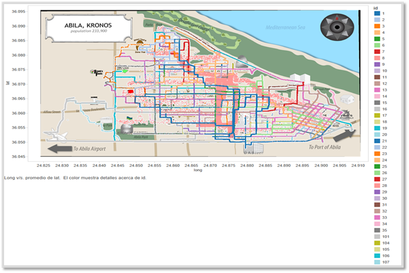
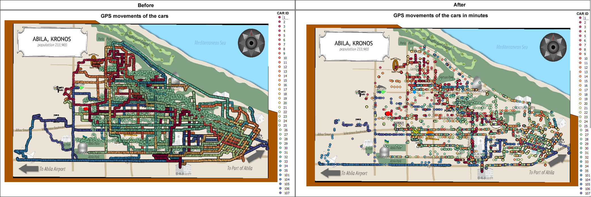
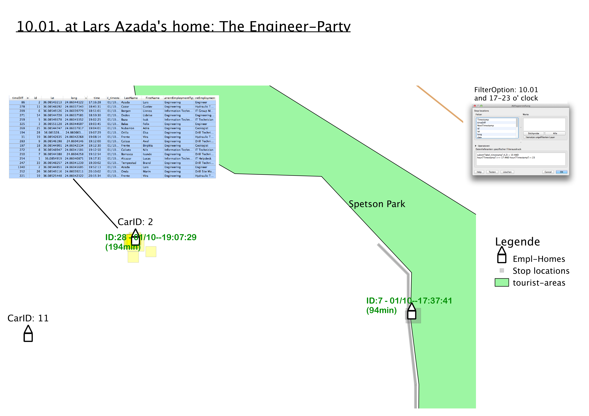
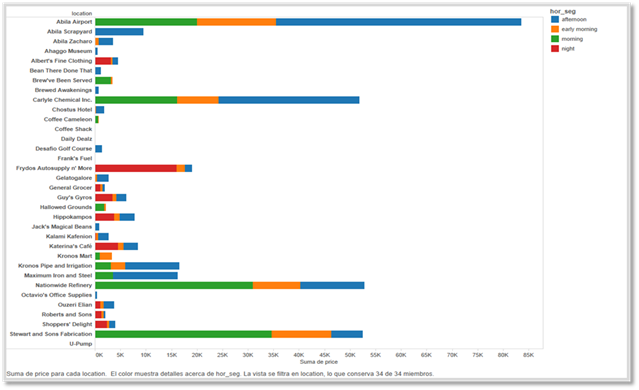
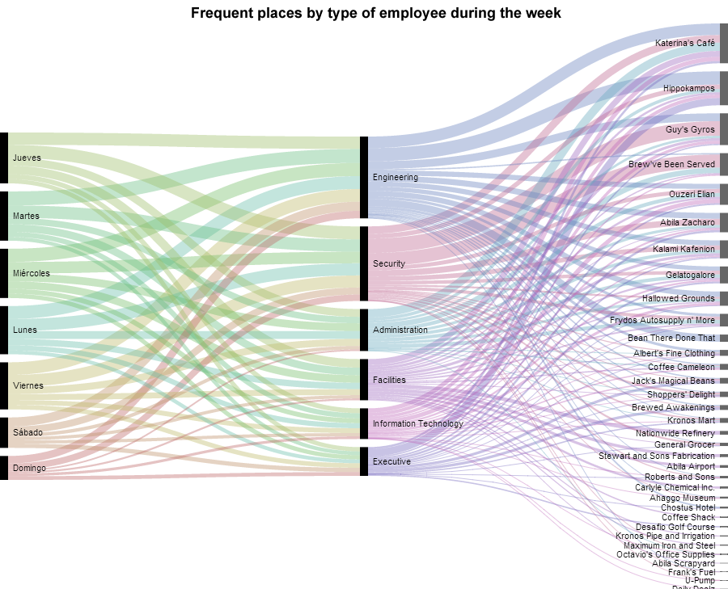
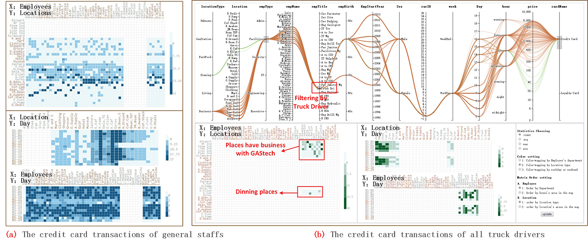
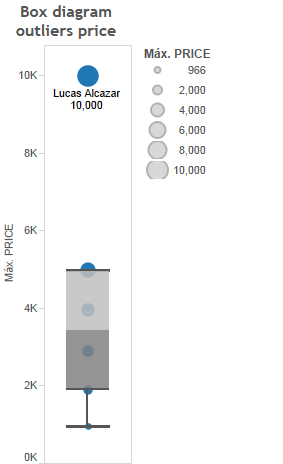

<style>

body{
  background-color: #EBEDEF;
  font-family:helvetica;
}
</style>

```{r setup, include=FALSE}
knitr::opts_chunk$set(fig.retina = 3,
                      echo = FALSE,
                      eval = TRUE,
                      message = FALSE,
                      warning = FALSE)
```

## Objective
The Visual Analytics Science and Technology (VAST) Challenge aims to advance visual analytics through a series of
competitions. The IEEE VAST Challenge 2021 is structured similarly to previous challenge in 2014, with similar data sets albeit slightly different questions. The VAST Challenge 2021 consists of three independent mini-challenges. We will be focusing on Mini Challenge 2 in this blog post.

In this blog post, we will firstly review previous visualizations to identify gaps where interactive visual analytics approach can be used to enhance user experience. Next, we will prepare the proposed interactive data analysis techniques to answer the Mini Challenge 2 questions.

Mini-Challenge 2 requires the analyst to analyze movement and tracking data, given tracking data for the two weeks leading up to the disappearance, as well as credit card transactions and loyalty card usage data. This assignment aims to identify anomalies and suspicious behaviors, infer the owners of each credit card and loyalty card and identify potential informal or unofficial relationships among GASTech personnel.

## Mini Challenge 2 Background

Many of the Abila, Kronos-based employees of GAStech have company cars which are approved for both personal and business use. Those who do not have company cars have the ability to check out company trucks for business use, but these trucks cannot be used for personal business.

Employees with company cars are happy to have these vehicles, because the company cars are generally much higher quality than the cars they would be able to afford otherwise. However, GAStech does not trust their employees. Without the employees? knowledge, GAStech has installed geospatial tracking software in the company vehicles. The vehicles are tracked periodically as long as they are moving.

This vehicle tracking data has been made available to law enforcement to support their investigation. Unfortunately, data is not available for the day the GAStech employees went missing. Data is only available for the two weeks prior to the disappearance.

To promote local businesses, Kronos based companies provide a Kronos Kares benefit card to GASTech employees giving them discounts and rewards in exchange for collecting information about their credit card purchases and preferences as recorded on loyalty cards. This data has been made available to investigators in the hopes that it can help resolve the situation. However, Kronos Kares does not collect personal information beyond purchases.

As a visual analytics expert assisting law enforcement, your mission is to identify which GASTech employees made which purchases and identify suspicious patterns of behavior. You must cope with uncertainties that result from missing, conflicting, and imperfect data to make recommendations for further investigation.

## Literature Review of previous analysis

The main aim of the assignment is to identify anomalies between the data provided and use those data sources to draw relationships. In order to do so, we would need to perform exploratory data analysis (EDA) to analyze data and gain insights. Effective visual data mining needs to display data in ways that human minds can easily perceive patterns and relationships in the data.

Most visualizations show geographically-referenced movement data use conventional Geographic Information Systems (GIS). Movement data are represented as lines on the map. The most basic form is a line between two points
which gives information about the movement of an object. Trajectory data can help in understanding of flow during an unusual event. Real world data sets typically do not provide singular trajectories. Instead, multiple trajectories tend to be mapped, as seen in Figure 1. However, when large data sets are involved, these trajectory lines tend to overlap, resulting in visual clutter and occlusions and makes the trajectory of individual lines illegible.

One way to overcome this is to adjust the opacity of the lines. This leads to less clutter. However, it results in data loss as some of the data may be hidden in order to reflect higher density areas (high frequency of trajectories). An alternative is to differentiate each line using colors, as what is done in Figure 1 below. Although this makes the lines with distinctive colors clearer, it does not resolve the constraint of large data sets as these lines still overlap and some colors may look similar since there is not enough colors to cover the whole data set. Interactive filtering and faceting allows for one to better manage large data sets with multiple trajectories, by selecting which trajectories are viewed at any one time.





Another limitation of trajectory maps are that they are unable to reflect the data's thematic attributes like direction and flow of traffic. One way to overcome this is cross-linking. Cross-linking links the trajectory map to another display of the data which presents the thematic attributes. It allows the user to hover over or select a point on either chart and the corresponding data on both charts will be highlighted. The combination of visual representations allows users to get a better understanding of the information from the data. In Figurre 3 below, the author has used annotation to reflect information in a separate table format. This has resulted in clutter and the information in the table is too small to be deciphered easily. An interactive datatable presented together with a map will resolve this issue as the user is able to filter for the carID, date and time they wish to get further details on.



Static visualizations Usually focused on a specific data story and users cannot go beyond a single view to explore additional stories beyond what is in front of them. In the stacked bar chart below, users can see which location is visited the most often and which time period they are popular. However, one limitation of the stacked bar chart is that it is difficult to compare relative size of the components that make up each bar. Also, as categories or data series are added, stacked column charts quickly become visually complex. In the figure below, it is hard for the user to compare the popularity of Abila Scrapyard and Kronos Pipe and Irrigation in the afternoon.

When exploring unexpected structure in graphics, it is useful to have selections made on one chart update the other. Cross-linking two charts allows for one to select groups of observations and interaction with one chart will change the other, giving the user multiple views of the selected observations.


An alternative view of popular times and locations is the use of parallel coordinates as shown in Figure 5 below. The user is able to decipher which locations are most popular during each day of the week, and which department it is popular with. However, due to the static nature of the chart, users are unable to obtain further information such as transaction amount. Also, the chart uses colors which are highly similar to show the different days and different departments. This makes it harder to read the chart. 



Another presentation is via the use of a heatmap. In Figure 6 below, we see that this results in a cluttered chart where the axis labels are not clear and visible. A heatmap also gives the user a broad view of the trends but without interactive features like tooltips, users are unable to obtain further details. Also, as the trends are represented by a color scale, it may be difficult to interpret for cells which have values close to each other and hence the colors do not differ visibly to the human eye.



The below boxplot shows the price range of all transactions recorded. Due to the static nature of the plot, we are unable to see other details such as transaction date and location. By applying brushing and cross-linking of two charts- the boxplot and another datatable, this allows for one to select groups of observations and interaction with one chart will change the other. Hence the user will be able to obtain more details on the selected observations.


## Suggested visualisations and R packages

There are gaps in the current visualizations in supporting the intended analysis of this assignment. The majority of visualizations are largely static and hence are unable to reflect a comprehensive overview of the multivariate data.

The full potential of interactivity in geovisualization lies in coordinated link view (CLV). CLV is a common data
visualization technique that allows the manipulation of visual presentation in different ways as well as coordinating the interaction between the different views. It is typically combined with brushing, which involves selecting specific objects by hovering over them or selecting them in the chart. These techniques make the use of multiple views more than the sum of its parts.

In this assignment, we will attempt to create interactive visualizations for multivariate analysis of geographically-referenced movement data, as well as the credit card and loyalty information provided. The focus will be on identifying potential relationships between each employee so as to identify potentially suspicious activity from the interactions observed.

The following R packages will be explored:

**Visualization**        |   **Packages**
-------------------------|---------------------------  
Bar Charts               | ggplot2, plotly
Interactivity            | plotly, ggiraph, crosstalk
Maps                     | tmap, raster, sf
Datatables               | DT


