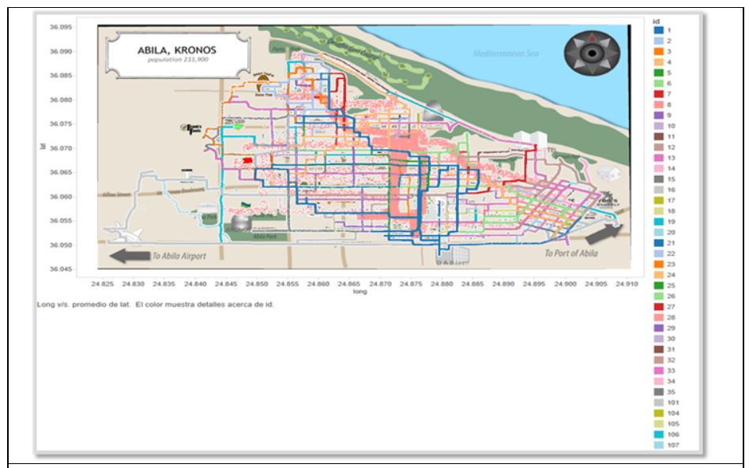

```{r setup, include=FALSE}
knitr::opts_chunk$set(echo = FALSE)
```

# Overview

The Visual Analytics Science and Technology (VAST) Challenge aims to advance visual analytics through a series of
competitions. The IEEE VAST Challenge 2021 is structured similarly to previous challenge in 2014, with similar data sets albeit slightly different questions. The VAST Challenge 2021 consists of three independent mini-challenges. We will be focusing on Mini Challenge 2 in this blog post.

In this blog post, we will firstly review previous visualizations to identify gaps where interactive visual analytics approach can be used to enhance user experience. Next, we will prepare the proposed interactive data analysis techniques to answer the Mini Challenge 2 questions.

Mini-Challenge 2 requires the analyst to analyze movement and tracking data, given tracking data for the two weeks leading up to the disappearance, as well as credit card transactions and loyalty card usage data. This assignment aims to identify anomalies and suspicious behaviors, infer the owners of each credit card and loyalty card and identify potential informal or unofficial relationships among GASTech personnel.

# Literature Review of previous analysis

The main aim of the assignment is to identify anomalies between the data provided and use those data sources to draw relationships. In order to do so, we would need to perform exploratory data analysis (EDA) to analyze data and gain insights. Effective visual data mining needs to display data in ways that human minds can easily perceive patterns and relationships in the data.

Most visualizations show geographically-referenced movement data use conventional Geographic Information Systems (GIS). Movement data are represented as lines on the map. The most basic form is a line between two points
which gives information about the movement of an object. Trajectory data can help in understanding of flow during an unusual event. Real world data sets typically do not provide singular trajectories. Instead, multiple trajectories tend to be mapped, as seen in Figure 1. However, when large data sets are involved, these trajectory lines tend to overlap, resulting in visual clutter and occlusions and makes the trajectory of individual lines illegible.

One way to overcome this is to adjust the opacity of the lines. This leads to less clutter. However, it results in data loss as some of the data may be hidden in order to reflect higher density areas (high frequency of trajectories). An alternative is to differentiate each line using colors, as what is done in Figure 1 below. Although this makes the lines with distinctive colors clearer, it does not resolve the constraint of large data sets as these lines still overlap and some colors may look similar since there is not enough colors to cover the whole data set. Interactive filtering allows for one to better manage large data sets with multiple trajectories, by selecting which trajectories are viewed at any one time.

Another limitation of trajectory maps are that they are unable to reflect the data's thematic attributes like direction and flow of traffic. One way to overcome this is cross-linking. Cross-linking links the trajectory map to another display of the data which presents the thematic attributes. It allows the user to hover over or select a point on either chart and the corresponding data on both charts will be highlighted. The combination of visual representations allows users to get a better understanding of the information from the data.



Static visualizations Usually focused on a specific data story and users cannot go beyond a single view to explore additional stories beyond what is in front of them. In the bar chart below, users can only see 1 point of view, which shows percentage of population speaking each language at home in New York. 

When exploring unexpected structure in graphics, it is useful to have selections made on one chart update the other. For example, if the user is exploring clusters observed on a scatterplot, it is useful to have the selected cluster update some chart of group membership, such as a jittered scatterplot or sets of bar charts. Brushing and cross-linking two charts allows for one to select groups of observations and interaction with one chart will change the other, giving the user multiple views of the selected observations.


# Suggested visualisations and R packages

There are gaps in the current visualizations in supporting the intended analysis of this assignment. The majority of visualizations are largely static and hence are unable to reflect a comprehensive overview of the multivariate data.

The full potential of interactivity in geovisualization lies in coordinated link view (CLV). CLV is a common data
visualization technique that allows the manipulation of visual presentation in different ways as well as coordinating the interaction between the different views. It is typically combined with brushing, which involves selecting specific objects by hovering over them or selecting them in the chart. These techniques make the use of multiple views more than the sum of its parts.

In this assignment, we will attempt to create interactive visualizations for multivariate analysis of geographically-referenced movement data, as well as the credit card and loyalty information provided. The focus will be on identifying potential relationships between each employee so as to identify potentially suspicious activity from the interactions observed.

The following R packages will be explored:

**Visualization**        |   **Packages**
-------------------------|---------------------------  
Bar Charts               | ggplot2, plotly
Interactivity            | plotly, ggiraph, crosstalk
Maps                     | tmap, raster, sf
Datatables               | DT


